# BookMyShow — Class Diagram

```mermaid
classDiagram
    direction TB

    %% ── Enums ───────────────────────────────────────────────────────────

    class SeatType {
        <<enumeration>>
        REGULAR(1.0)
        PREMIUM(1.5)
        RECLINER(2.0)
        -double multiplier
        +getMultiplier() double
    }

    class SeatStatus {
        <<enumeration>>
        AVAILABLE
        LOCKED
        BOOKED
    }

    class BookingStatus {
        <<enumeration>>
        PENDING
        CONFIRMED
        CANCELLED
    }

    class Genre {
        <<enumeration>>
        ACTION
        COMEDY
        DRAMA
        THRILLER
        HORROR
    }

    %% ── Core Entities ───────────────────────────────────────────────────

    class Movie {
        -String id
        -String title
        -int durationMins
        -String language
        -Genre genre
        +getId() String
        +getTitle() String
        +getDurationMins() int
        +getLanguage() String
        +getGenre() Genre
    }

    class Theater {
        -String id
        -String name
        -String city
        -List~Screen~ screens
        +addScreen(Screen) void
        +getScreens() List~Screen~
        +getId() String
        +getName() String
        +getCity() String
    }

    class Screen {
        -String id
        -String name
        -Seat[][] seatLayout
        -List~Show~ shows
        +addShow(Show) void
        +getShows() List~Show~
        +getId() String
        +getName() String
        +getSeatLayout() Seat[][]
    }

    class Seat {
        -String id
        -int row
        -int col
        -SeatType type
        -double basePrice
        +getId() String
        +getRow() int
        +getCol() int
        +getType() SeatType
        +getBasePrice() double
    }

    class Show {
        -String id
        -Movie movie
        -Screen screen
        -LocalDateTime startTime
        -LocalDateTime endTime
        -ConcurrentHashMap~String,SeatStatus~ seatStatusMap
        +getSeatStatus(seatId) SeatStatus
        +updateSeatStatus(seatId, SeatStatus) void
        +getId() String
        +getMovie() Movie
        +getScreen() Screen
        +getStartTime() LocalDateTime
        +getEndTime() LocalDateTime
    }

    class SeatLock {
        -String lockId
        -String showId
        -List~String~ seatIds
        -String userId
        -LocalDateTime expiresAt
        +isExpired() boolean
        +getLockId() String
        +getShowId() String
        +getSeatIds() List~String~
        +getUserId() String
        +getExpiresAt() LocalDateTime
    }

    class Booking {
        -String id
        -String userId
        -Show show
        -List~Seat~ seats
        -double totalPrice
        -LocalDateTime createdAt
        -volatile BookingStatus status
        -volatile String paymentId
        +confirm(paymentId) void
        +cancel() void
        +getId() String
        +getUserId() String
        +getShow() Show
        +getSeats() List~Seat~
        +getTotalPrice() double
        +getStatus() BookingStatus
        +getPaymentId() String
        +getCreatedAt() LocalDateTime
    }

    %% ── BookingService (Singleton + Facade + Inline Data) ────────────────

    class BookingService {
        <<Singleton + Facade>>
        -static volatile BookingService INSTANCE
        -ConcurrentHashMap~String,Show~ shows
        -ConcurrentHashMap~String,Booking~ bookings
        -ConcurrentHashMap~String,SeatLock~ locks
        -ConcurrentHashMap~String,ReentrantLock~ showLocks
        -PricingStrategy pricingStrategy
        -CancellationPolicy cancellationPolicy
        -PaymentService paymentService
        -List~NotificationService~ observers
        +getInstance(pricing, cancellation, payment, observers) BookingService$
        +resetInstance() void$
        +registerShow(Show) void
        +getSeatMap(showId) Map~String,SeatStatus~
        +lockSeats(showId, seatIds, userId) SeatLock
        +confirmBooking(lockId) Booking
        +cancelBooking(bookingId, userId) Booking
        -releaseSeats(Show, seatIds) void
        -resolveSeats(Show, seatIds) List~Seat~
        -expireStaleLocksFor(showId) void
    }

    %% ── Strategy: Pricing ───────────────────────────────────────────────

    class PricingStrategy {
        <<interface>>
        +calculatePrice(List~Seat~) double
    }

    class DefaultPricingStrategy {
        +calculatePrice(List~Seat~) double
    }

    class SurgePricingStrategy {
        -double surgeMultiplier
        +SurgePricingStrategy(double surgeMultiplier)
        +calculatePrice(List~Seat~) double
    }

    %% ── Strategy: Cancellation ──────────────────────────────────────────

    class CancellationPolicy {
        <<interface>>
        +canCancel(Booking) boolean
    }

    class StandardCancellationPolicy {
        +canCancel(Booking) boolean
    }

    %% ── Observer: Notifications ─────────────────────────────────────────

    class NotificationService {
        <<interface>>
        +onBookingConfirmed(Booking) void
        +onBookingCancelled(Booking) void
    }

    class EmailNotificationService {
        +onBookingConfirmed(Booking) void
        +onBookingCancelled(Booking) void
    }

    class SMSNotificationService {
        +onBookingConfirmed(Booking) void
        +onBookingCancelled(Booking) void
    }

    %% ── Payment ─────────────────────────────────────────────────────────

    class PaymentService {
        <<interface>>
        +processPayment(double amount) String
        +refund(String paymentId) void
    }

    class MockPaymentService {
        +processPayment(double amount) String
        +refund(String paymentId) void
    }

    %% ── Exceptions ──────────────────────────────────────────────────────

    class SeatNotAvailableException {
        +SeatNotAvailableException(String msg)
    }

    class ShowOverlapException {
        +ShowOverlapException(String msg)
    }

    %% ── Entity Relationships ─────────────────────────────────────────────

    Theater  "1" *-- "1..*" Screen    : contains
    Screen   "1" *-- "many" Seat      : seatLayout (2D array)
    Screen   "1" o-- "0..*" Show      : schedules
    Show     "1" --> "1"    Movie     : plays
    Show     "1" --> "1"    Screen    : hosted in
    Booking  "1" --> "1"    Show      : for show
    Booking  "1" --> "1..*" Seat      : reserves seats
    SeatLock "1" --> "1"    Show      : locks seats in

    %% ── Strategy Pattern ─────────────────────────────────────────────────

    PricingStrategy    <|.. DefaultPricingStrategy    : implements
    PricingStrategy    <|.. SurgePricingStrategy      : implements
    BookingService     --> PricingStrategy            : uses (Strategy)

    CancellationPolicy <|.. StandardCancellationPolicy : implements
    BookingService     --> CancellationPolicy          : uses (Strategy)

    %% ── Observer Pattern ─────────────────────────────────────────────────

    NotificationService <|.. EmailNotificationService : implements
    NotificationService <|.. SMSNotificationService   : implements
    BookingService      --> NotificationService       : notifies (Observer)

    %% ── Payment ──────────────────────────────────────────────────────────

    PaymentService     <|.. MockPaymentService : implements
    BookingService     --> PaymentService       : delegates payment

    %% ── Inline Data Stores ───────────────────────────────────────────────

    BookingService     --> Show                 : stores (ConcurrentHashMap)
    BookingService     --> Booking              : stores (ConcurrentHashMap)
    BookingService     --> SeatLock             : stores (ConcurrentHashMap)

    %% ── Enum Usage ───────────────────────────────────────────────────────

    Seat    --> SeatType       : has type
    Show    --> SeatStatus     : tracks per-seat
    Booking --> BookingStatus  : has status
    Movie   --> Genre          : categorized by
```



---

## Design Patterns Summary

| Pattern | Where | Benefit |
|---------|-------|---------|
| **Singleton** | `BookingService` (volatile + DCL) | One instance owns the per-show lock map — prevents race conditions across threads |
| **Strategy** | `PricingStrategy`, `CancellationPolicy` | Swap pricing/cancellation rules at runtime without changing `BookingService` |
| **Observer** | `NotificationService` | Add new notification channels (push, WhatsApp) without touching booking logic |
| **Facade** | `BookingService` | Single entry point for the entire lock → price → pay → confirm → notify flow |

---

## Thread Safety Mechanisms

| Mechanism | Where | Purpose |
|-----------|-------|---------|
| `ConcurrentHashMap` | `Show.seatStatusMap`, `BookingService` data stores | Thread-safe per-key read/write without global locking |
| `ReentrantLock` per show | `BookingService.showLocks` | Atomic check-then-set for seat locking (prevents double booking) |
| `volatile` | `Booking.status`, `Booking.paymentId` | Cross-thread visibility without synchronized reads |
| `synchronized` | `Booking.confirm()`, `Booking.cancel()`, `Screen/Theater` methods | Atomic state transitions and list mutations |
| `volatile` + DCL | `BookingService.INSTANCE` | Safe lazy singleton publication |
| `List.copyOf()` | `SeatLock.seatIds`, `Booking.seats` | Immutable defensive copies — no external mutation |
| `Collections.unmodifiableList()` | `Screen.getShows()`, `Theater.getScreens()` | Read-only views for external callers |

---

## Data Structures & Justification

| Data Structure | Where Used | Why This Choice |
|---------------|-----------|-----------------|
| **`ConcurrentHashMap<String, SeatStatus>`** | `Show.seatStatusMap` | O(1) lookup per seat. Thread-safe per-key writes without global lock. Individual seat reads never block each other. Perfect for high-concurrency seat status tracking. |
| **`ConcurrentHashMap<String, ReentrantLock>`** | `BookingService.showLocks` | One lock per show — unrelated shows never contend. `computeIfAbsent()` creates locks lazily and atomically. Massive throughput vs a single global lock. |
| **`ConcurrentHashMap<String, Show/Booking/SeatLock>`** | `BookingService` inline stores | O(1) CRUD by ID. Thread-safe without external synchronization. Replaces a full repository layer with minimal code. |
| **`Seat[][]` (2D array)** | `Screen.seatLayout` | Fixed-size, created once. Row/col addressing is natural for a theater layout. More memory-efficient than nested Lists (no object overhead per element). O(1) access by position. |
| **`ArrayList<Show>`** | `Screen.shows` | Ordered insertion of shows. Wrapped with `synchronized` access and `Collections.unmodifiableList()` for thread safety. |
| **`ArrayList<Screen>`** | `Theater.screens` | Same pattern as shows — ordered, synchronized access, unmodifiable view returned. |
| **`List.copyOf()` (immutable list)** | `SeatLock.seatIds`, `Booking.seats` | Creates an immutable snapshot at construction time. Prevents external code from mutating seat references after lock/booking creation. Thread-safe by nature. |
| **`UUID`** | Booking IDs, Payment IDs, Lock IDs | Globally unique identifiers without coordination. No central sequence generator needed. |

### Why Not Other Data Structures?

| Alternative | Rejected Because |
|------------|------------------|
| `HashMap` for seat status | Not thread-safe — would need external `synchronized` blocks for every access |
| `TreeMap` for seats | O(log n) lookups. We don't need ordered traversal — O(1) by ID is sufficient |
| `List<Seat>` for screen layout | Loses row/col spatial relationship. 2D array gives natural `[row][col]` addressing |
| `synchronized` HashMap | `ConcurrentHashMap` has better throughput — allows concurrent reads and segment-level locking |
| `AtomicReference` for seat status | Per-seat atomic is overkill — we need multi-seat atomic transitions (lock multiple seats together), which requires explicit `ReentrantLock` |

---

## File Structure (15 Java files total)

```
src/com/bookmyshow/
├── Main.java                              # E2E demo driver
├── enums/
│   ├── BookingStatus.java                 # PENDING | CONFIRMED | CANCELLED
│   ├── Genre.java                         # ACTION | COMEDY | DRAMA | THRILLER | HORROR
│   ├── SeatStatus.java                    # AVAILABLE | LOCKED | BOOKED
│   └── SeatType.java                      # REGULAR(1.0) | PREMIUM(1.5) | RECLINER(2.0)
├── models/
│   ├── Booking.java                       # Booking entity (volatile + synchronized)
│   ├── Movie.java                         # Immutable movie metadata
│   ├── Screen.java                        # 2D Seat[][] layout + shows list
│   ├── Seat.java                          # Immutable seat with row/col/type/price
│   ├── SeatLock.java                      # TTL-based temporary lock (immutable)
│   ├── Show.java                          # ConcurrentHashMap<seatId, SeatStatus>
│   └── Theater.java                       # Aggregates screens
├── service/
│   └── BookingService.java                # ★ Singleton + Facade + Inline Data + Concurrency
├── strategy/
│   ├── PricingStrategy.java               # Strategy interface
│   ├── DefaultPricingStrategy.java        # basePrice × seatType multiplier
│   ├── SurgePricingStrategy.java          # basePrice × seatType × surge multiplier
│   ├── CancellationPolicy.java            # Strategy interface
│   └── StandardCancellationPolicy.java    # 2-hour before show cutoff
├── observer/
│   ├── NotificationService.java           # Observer interface
│   ├── EmailNotificationService.java      # Email channel
│   └── SMSNotificationService.java        # SMS channel
├── payment/
│   ├── PaymentService.java                # Payment interface
│   └── MockPaymentService.java            # Always succeeds (demo)
└── exceptions/
    ├── SeatNotAvailableException.java     # Thrown when seat is LOCKED or BOOKED
    └── ShowOverlapException.java          # Thrown on schedule conflict
```
