# Hotel Management System — Class Diagram

---

## Mermaid Class Diagram

```mermaid
classDiagram
    direction TB

    %% ===== ENUMS =====
    class RoomType {
        <<enumeration>>
        SINGLE
        DOUBLE
        DELUXE
        SUITE
    }

    class RoomStatus {
        <<enumeration>>
        AVAILABLE
        RESERVED
        OCCUPIED
        UNDER_MAINTENANCE
    }

    class BookingStatus {
        <<enumeration>>
        PENDING
        CONFIRMED
        CHECKED_IN
        CHECKED_OUT
        CANCELLED
    }

    class PaymentMethod {
        <<enumeration>>
        CREDIT_CARD
        DEBIT_CARD
        UPI
        CASH
    }

    class PaymentStatus {
        <<enumeration>>
        PENDING
        COMPLETED
        FAILED
        REFUNDED
    }

    %% ===== MODELS =====
    class Hotel {
        -String id
        -String name
        -String location
        -ConcurrentHashMap~String, Room~ rooms
        +addRoom(Room) void
        +removeRoom(String) void
        +getRoomsByType(RoomType) List~Room~
    }

    class Room {
        -String id
        -String hotelId
        -int floorNumber
        -int roomNumber
        -RoomType type
        -RoomStatus status
        -double basePricePerNight
        -ReentrantLock lock
        +acquireLock() boolean
        +releaseLock() void
        +isAvailableForDates(LocalDate, LocalDate) boolean
    }

    class Guest {
        -String id
        -String name
        -String email
        -String phone
        -String idProof
        -List~Booking~ bookingHistory
    }

    class Booking {
        -String id
        -String guestId
        -String roomId
        -String hotelId
        -LocalDate checkInDate
        -LocalDate checkOutDate
        -BookingStatus status
        -double totalAmount
        -LocalDateTime createdAt
        -LocalDateTime holdExpiryTime
    }

    class Payment {
        -String id
        -String bookingId
        -double amount
        -PaymentMethod method
        -PaymentStatus status
        -LocalDateTime timestamp
    }

    %% ===== SERVICES =====
    class HotelManagementSystem {
        -static HotelManagementSystem instance
        -RoomManager roomManager
        -BookingManager bookingManager
        -PaymentService paymentService
        -SearchService searchService
        -NotificationService notificationService
        +static getInstance() HotelManagementSystem
        +searchRooms(String, LocalDate, LocalDate, RoomType) List~Room~
        +createBooking(String, String, LocalDate, LocalDate) Booking
        +cancelBooking(String) void
        +checkIn(String) void
        +checkOut(String) void
    }

    class RoomManager {
        -ConcurrentHashMap~String, Room~ roomRegistry
        -ConcurrentHashMap~String, TreeMap~LocalDate, String~~ roomReservations
        +allocateRoom(String, LocalDate, LocalDate) boolean
        +releaseRoom(String, LocalDate, LocalDate) void
        +isRoomAvailable(String, LocalDate, LocalDate) boolean
        +getAvailableRooms(String, LocalDate, LocalDate, RoomType) List~Room~
    }

    class BookingManager {
        -ConcurrentHashMap~String, Booking~ bookings
        -AtomicLong bookingCounter
        -ScheduledExecutorService holdExpiryScheduler
        +createBooking(String, String, LocalDate, LocalDate) Booking
        +confirmBooking(String) void
        +cancelBooking(String) void
        +checkIn(String) void
        +checkOut(String) void
        -scheduleHoldExpiry(String) void
    }

    class SearchService {
        -ConcurrentHashMap~String, Hotel~ hotelRegistry
        -ConcurrentHashMap~RoomType, TreeSet~Room~~ roomsByTypeAndPrice
        +searchByDateRange(String, LocalDate, LocalDate) List~Room~
        +searchByTypeAndPrice(RoomType, double, double) List~Room~
        +searchByLocation(String) List~Hotel~
    }

    class PaymentService {
        <<interface>>
        +processPayment(Booking, PaymentMethod) Payment
        +processRefund(Booking) Payment
        +calculateTotal(Booking) double
    }

    class DefaultPaymentService {
        -double taxRate
        +processPayment(Booking, PaymentMethod) Payment
        +processRefund(Booking) Payment
        +calculateTotal(Booking) double
    }

    class NotificationService {
        <<interface>>
        +notifyBookingConfirmed(Booking, Guest) void
        +notifyCheckIn(Booking, Guest) void
        +notifyCheckOut(Booking, Guest) void
        +notifyCancellation(Booking, Guest) void
    }

    class EmailNotificationService {
        +notifyBookingConfirmed(Booking, Guest) void
        +notifyCheckIn(Booking, Guest) void
        +notifyCheckOut(Booking, Guest) void
        +notifyCancellation(Booking, Guest) void
    }

    %% ===== EXCEPTIONS =====
    class RoomNotAvailableException {
        +RoomNotAvailableException(String)
    }

    class InvalidBookingException {
        +InvalidBookingException(String)
    }

    %% ===== RELATIONSHIPS =====
    Hotel "1" *-- "*" Room : contains
    Guest "1" o-- "*" Booking : makes
    Booking "1" --> "1" Room : reserves
    Booking "1" --> "1" Payment : has
    Room --> RoomType : has
    Room --> RoomStatus : has
    Booking --> BookingStatus : has
    Payment --> PaymentMethod : uses
    Payment --> PaymentStatus : has

    HotelManagementSystem --> RoomManager : uses
    HotelManagementSystem --> BookingManager : uses
    HotelManagementSystem --> SearchService : uses
    HotelManagementSystem --> PaymentService : uses
    HotelManagementSystem --> NotificationService : uses

    PaymentService <|.. DefaultPaymentService : implements
    NotificationService <|.. EmailNotificationService : implements
```

---

## Key Relationships Summary

| Relationship | Type | Description |
|---|---|---|
| Hotel → Room | Composition (1:N) | Hotel owns rooms; rooms don't exist without hotel |
| Guest → Booking | Aggregation (1:N) | Guest can have multiple bookings |
| Booking → Room | Association (1:1) | Each booking reserves exactly one room |
| Booking → Payment | Association (1:1) | Each confirmed booking has one payment |
| HotelManagementSystem → Managers | Dependency | Facade delegates to specialized managers |
| PaymentService | Interface | Strategy pattern for payment processing |
| NotificationService | Interface | Observer pattern for event notifications |

---

## Thread Safety Design (Per-Class)

| Class | Mechanism | Why |
|---|---|---|
| Room | `ReentrantLock` per instance | Fine-grained lock for concurrent allocation |
| RoomManager | `ConcurrentHashMap` + per-room locks | Multiple rooms can be booked in parallel |
| BookingManager | `ConcurrentHashMap` + `AtomicLong` | Thread-safe booking registry + ID generation |
| SearchService | `ConcurrentHashMap` + `TreeMap` (read-heavy) | Concurrent reads, occasional writes |
| HotelManagementSystem | Singleton with double-checked locking | Single entry point, thread-safe init |

---

## Data Structure Choices

| Data Structure | Used In | Purpose | Complexity |
|---|---|---|---|
| `ConcurrentHashMap<String, Room>` | RoomManager | O(1) room lookup by ID | O(1) get/put |
| `TreeMap<LocalDate, String>` | RoomManager | Sorted date-based reservation tracking | O(log n) range query |
| `TreeSet<Room>` (by price) | SearchService | Rooms sorted by price for range queries | O(log n) search |
| `ConcurrentHashMap<String, Booking>` | BookingManager | O(1) booking lookup | O(1) get/put |
| `AtomicLong` | BookingManager | Lock-free ID generation | O(1) |
| `ScheduledExecutorService` | BookingManager | Automatic hold expiry after TTL | Async |
| `PriorityQueue<Room>` | SearchService | Return cheapest available rooms first | O(log n) poll |
