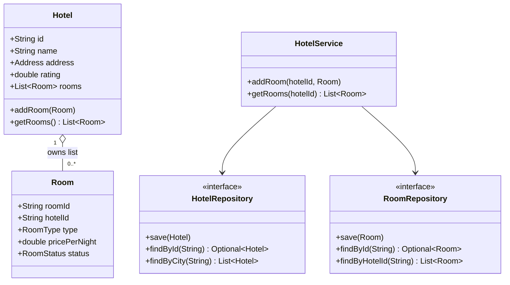
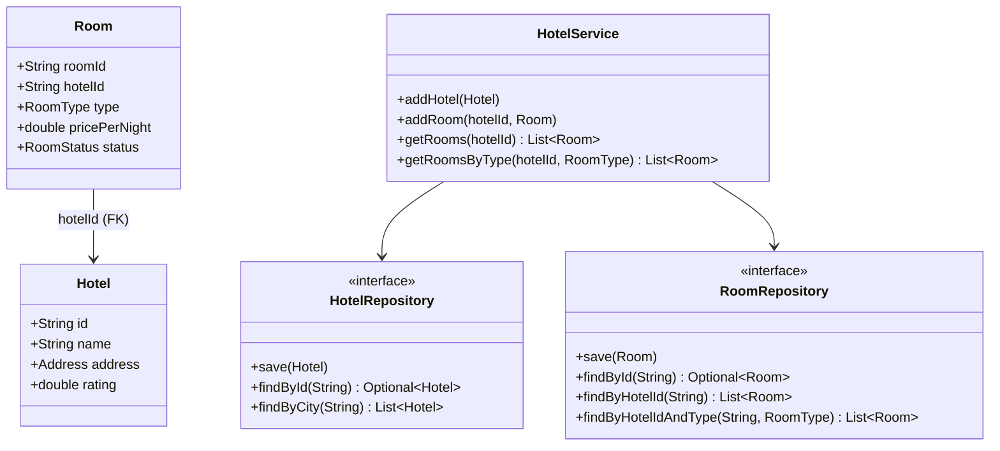
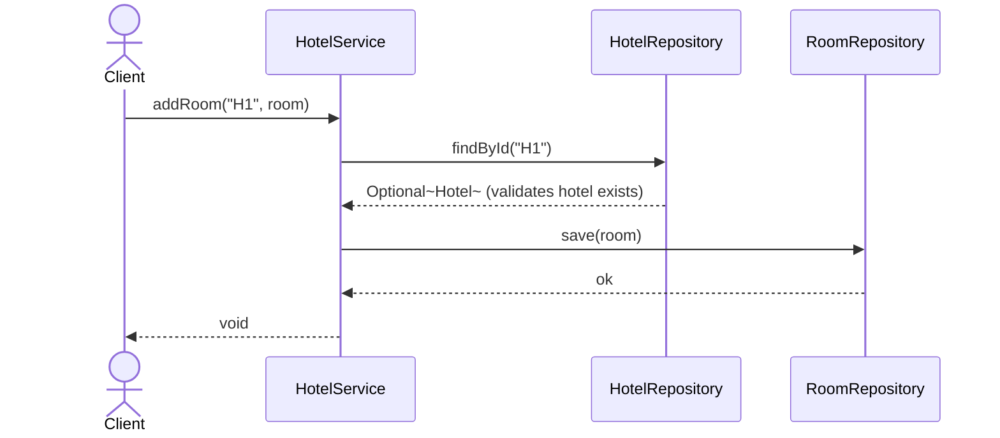
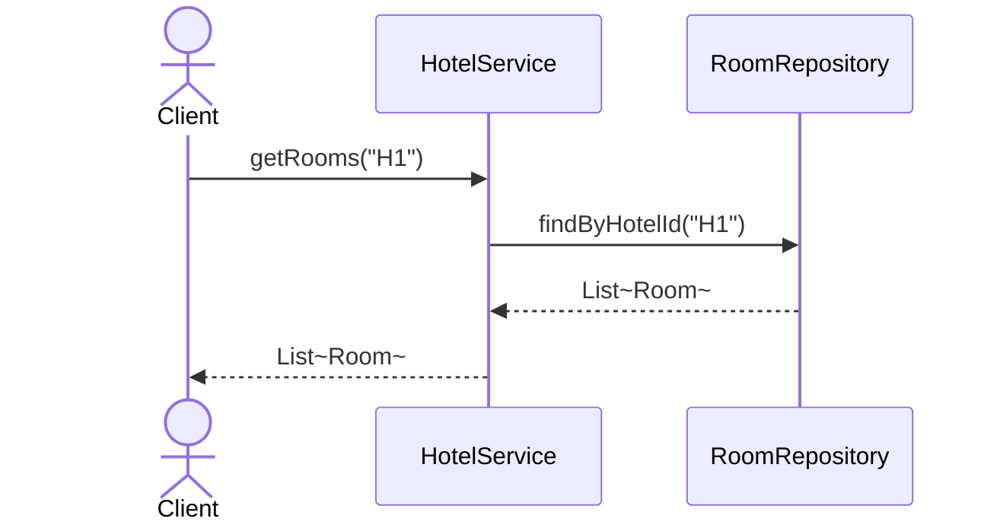
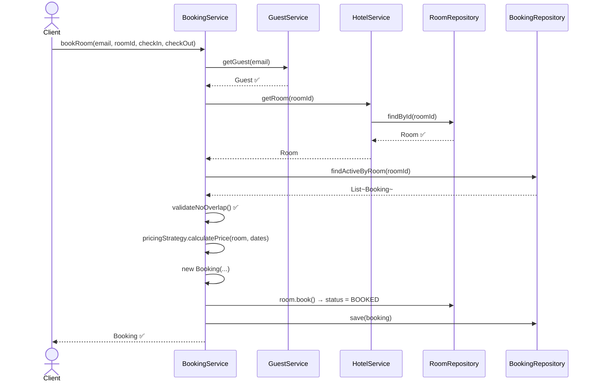
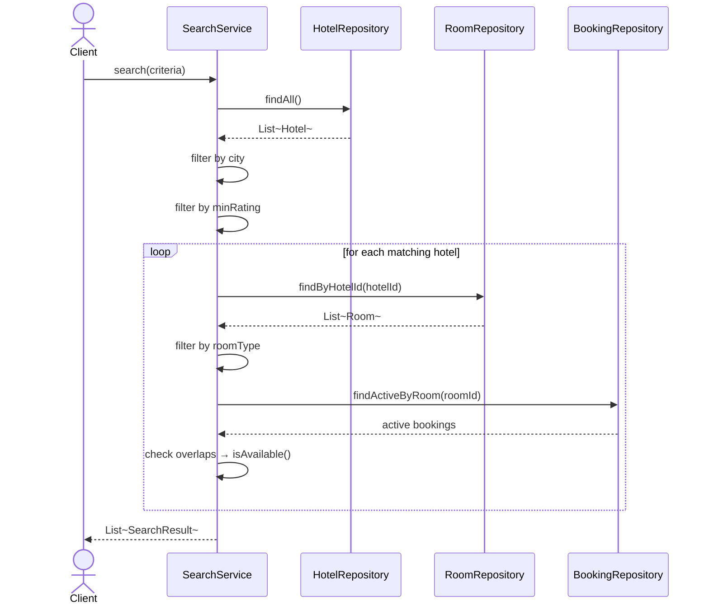

# Hotel Management System — Service Level Design

## The Core Question

> Hotel has `List<Room>` inside it **vs** Rooms live only in `RoomRepository` — which is better?

Two options:

| | Option A — Aggregate Root | Option B — Thin Entity (Recommended) |
|---|---|---|
| `Hotel` | holds `List<Room>` | holds **no** room list |
| Source of truth | Hotel object + RoomRepository (dual) | RoomRepository only (single) |
| Get rooms | `hotel.getRooms()` | `roomRepo.findByHotelId(id)` |
| Risk | Inconsistency if Hotel loaded without rooms | None |
| When to use | LLD interview (in-memory, simple) | Production / DDD |

---

## Option A — Hotel owns List\<Room\> (what we built)

**Problem:** `Hotel.rooms` and `RoomRepository` are two sources of truth.  
If Hotel is reloaded from a DB later, `hotel.getRooms()` returns stale/empty data.

---

## Option B — Thin Hotel, Repository is the only source of truth ✅

**Room points to Hotel via `hotelId` (like a foreign key). Hotel never holds the list.**  
`HotelService.getRooms(hotelId)` always delegates to `roomRepository.findByHotelId()`.

---

## Step-by-Step Service Flow

### addRoom()

### getRooms()

### bookRoom() — full flow

### search() — filter chain

---

## Verdict

| Scenario | Use |
|---|---|
| LLD interview (in-memory, simple demo) | Option A — Hotel with `List<Room>` is fine |
| Production code / persistence layer | **Option B** — Repository is single source of truth |

The key principle: **Repository owns the collection, not the parent entity.**  
`Hotel` knowing about `Room` is a convenience, not a responsibility.
