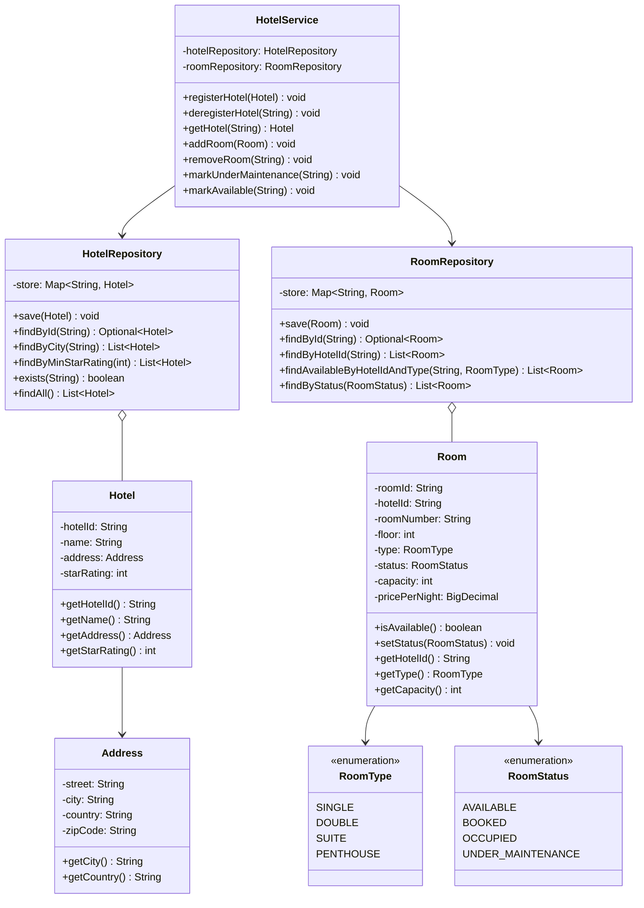
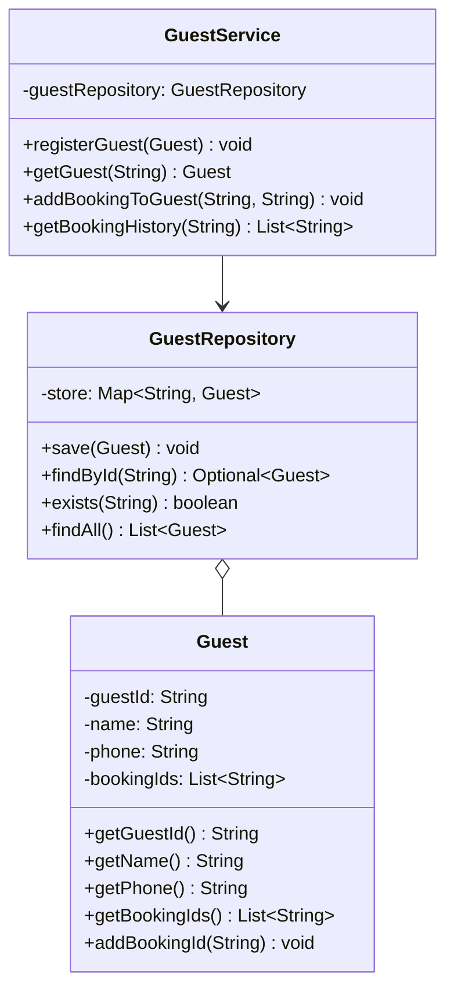
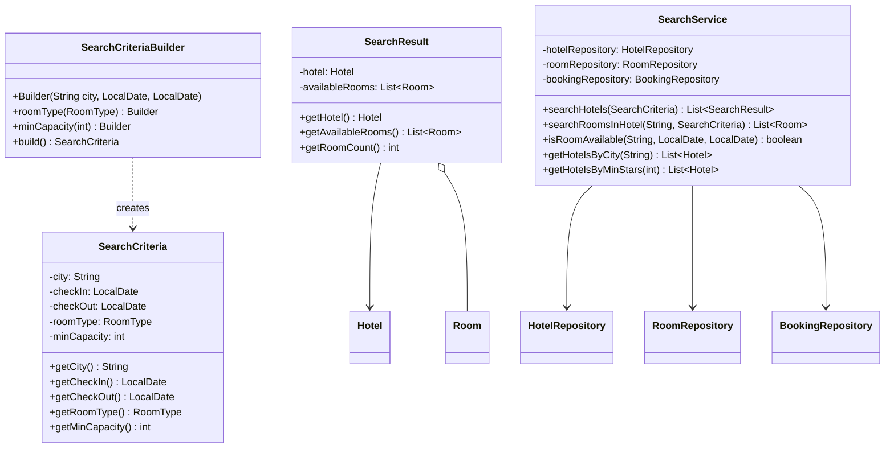
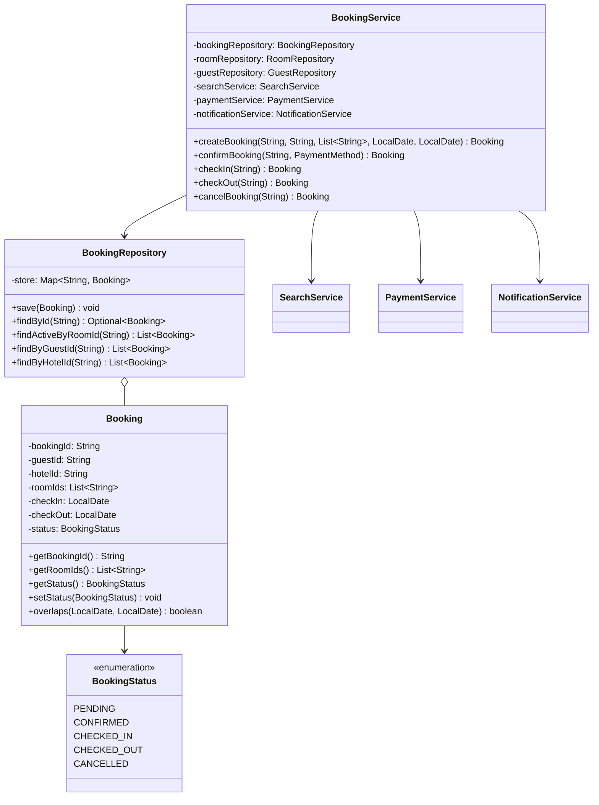
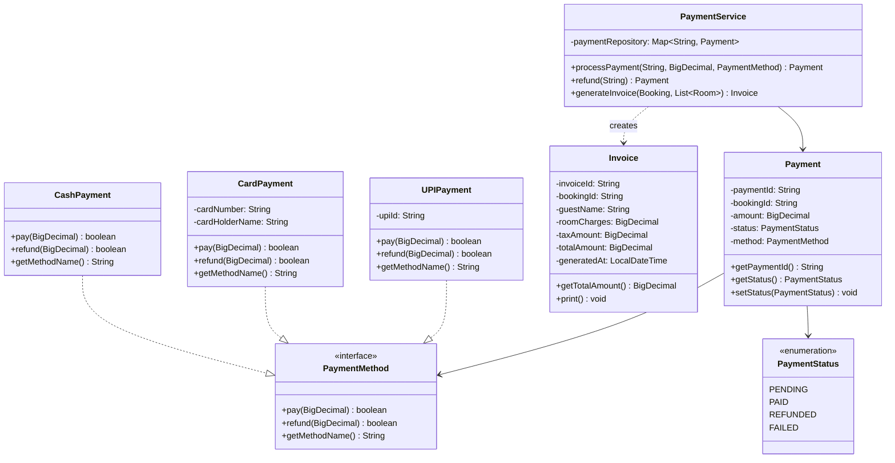
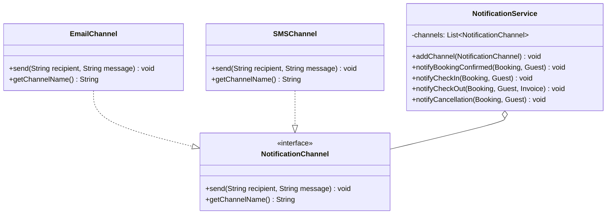
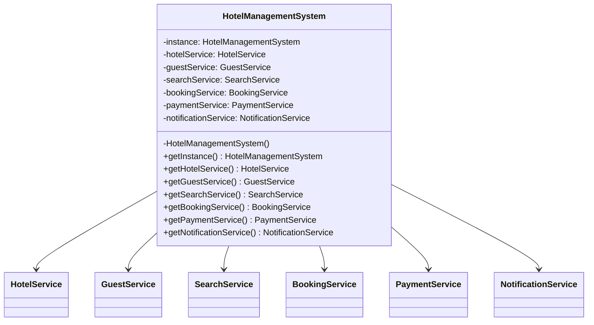

# Hotel Management System — Class Diagrams

---

## Component 1: Hotel & Room Management

> Responsibility: Lifecycle operations only — register, add, update, delete.
> Actor: Hotel Admin, Chain Admin.
> Rule: If it creates or mutates a resource, it belongs here.

---

## Component 2: Guest Management

> Responsibility: Guest lifecycle — register, fetch, update booking history.
> Actor: Guest (self-registration), Front Desk (walk-in registration).

---

## Component 3: Search

> Responsibility: All discovery and availability queries.
> Actor: Guest.
> Rule: If the operation answers "what exists and is available?", it belongs here.
>
> getHotelsByCity()    → moved HERE from HotelService (it is a query, not management)
> getAvailableRooms()  → moved HERE from HotelService (it is a query, not management)

---

## Component 4: Booking Service

> Responsibility: Full booking lifecycle — create, confirm, check-in, check-out, cancel.
> Owns the BookingStatus FSM. Handles concurrency via sorted room locking.

---

## Component 5: Payment

> Responsibility: Charge, refund, invoice generation.
> Pattern: Strategy — PaymentMethod is an interface; Cash/Card/UPI are strategies.

---

## Component 6: Notification

> Responsibility: Notify guests on booking events.
> Pattern: Observer — NotificationService holds a list of channels;
>          new channels (push, WhatsApp) add without changing the service.

---

## Component 7: HMS Facade (Singleton)

> Single entry point. Constructs and wires all repositories and services.
> Private constructor prevents external instantiation.

---

## Complete System Class Diagram

```mermaid
classDiagram
    %% ── Enums ────────────────────────────────────────────────────────────────
    class RoomType {
        <<enumeration>>
        SINGLE
        DOUBLE
        SUITE
        PENTHOUSE
    }
    class RoomStatus {
        <<enumeration>>
        AVAILABLE
        BOOKED
        OCCUPIED
        UNDER_MAINTENANCE
    }
    class BookingStatus {
        <<enumeration>>
        PENDING
        CONFIRMED
        CHECKED_IN
        CHECKED_OUT
        CANCELLED
    }
    class PaymentStatus {
        <<enumeration>>
        PENDING
        PAID
        REFUNDED
        FAILED
    }

    %% ── Models ───────────────────────────────────────────────────────────────
    class Address {
        -street: String
        -city: String
        -country: String
        -zipCode: String
    }
    class Hotel {
        -hotelId: String
        -name: String
        -address: Address
        -starRating: int
    }
    class Room {
        -roomId: String
        -hotelId: String
        -floor: int
        -type: RoomType
        -status: RoomStatus
        -capacity: int
        -pricePerNight: BigDecimal
        +isAvailable() boolean
        +overlaps via Booking
    }
    class Guest {
        -guestId: String
        -name: String
        -phone: String
        -bookingIds: List~String~
    }
    class Booking {
        -bookingId: String
        -guestId: String
        -hotelId: String
        -roomIds: List~String~
        -checkIn: LocalDate
        -checkOut: LocalDate
        -status: BookingStatus
        +overlaps(LocalDate, LocalDate) boolean
    }
    class Payment {
        -paymentId: String
        -bookingId: String
        -amount: BigDecimal
        -status: PaymentStatus
        -method: PaymentMethod
    }
    class Invoice {
        -invoiceId: String
        -bookingId: String
        -roomCharges: BigDecimal
        -taxAmount: BigDecimal
        -totalAmount: BigDecimal
    }
    class SearchCriteria {
        -city: String
        -checkIn: LocalDate
        -checkOut: LocalDate
        -roomType: RoomType
        -minCapacity: int
    }
    class SearchResult {
        -hotel: Hotel
        -availableRooms: List~Room~
    }

    %% ── Interfaces ───────────────────────────────────────────────────────────
    class PaymentMethod {
        <<interface>>
        +pay(BigDecimal) boolean
        +refund(BigDecimal) boolean
    }
    class NotificationChannel {
        <<interface>>
        +send(String, String) void
    }

    %% ── Implementations ──────────────────────────────────────────────────────
    class CashPayment { +pay(BigDecimal) boolean }
    class CardPayment { -cardNumber: String }
    class UPIPayment  { -upiId: String }
    class EmailChannel { +send(String, String) void }
    class SMSChannel   { +send(String, String) void }

    %% ── Repositories ─────────────────────────────────────────────────────────
    class HotelRepository {
        +findByCity(String) List~Hotel~
        +findByMinStarRating(int) List~Hotel~
    }
    class RoomRepository {
        +findByHotelId(String) List~Room~
        +findAvailableByHotelIdAndType(String, RoomType) List~Room~
    }
    class GuestRepository {
        +findById(String) Optional~Guest~
    }
    class BookingRepository {
        +findActiveByRoomId(String) List~Booking~
        +findByGuestId(String) List~Booking~
    }

    %% ── Services ─────────────────────────────────────────────────────────────
    class HotelService {
        +registerHotel(Hotel) void
        +addRoom(Room) void
        +markUnderMaintenance(String) void
        +markAvailable(String) void
    }
    class GuestService {
        +registerGuest(Guest) void
        +getGuest(String) Guest
    }
    class SearchService {
        +searchHotels(SearchCriteria) List~SearchResult~
        +searchRoomsInHotel(String, SearchCriteria) List~Room~
        +getHotelsByCity(String) List~Hotel~
        +isRoomAvailable(String, LocalDate, LocalDate) boolean
    }
    class BookingService {
        +createBooking(String, String, List~String~, LocalDate, LocalDate) Booking
        +confirmBooking(String, PaymentMethod) Booking
        +checkIn(String) Booking
        +checkOut(String) Booking
        +cancelBooking(String) Booking
    }
    class PaymentService {
        +processPayment(String, BigDecimal, PaymentMethod) Payment
        +refund(String) Payment
        +generateInvoice(Booking) Invoice
    }
    class NotificationService {
        +notifyBookingConfirmed(Booking, Guest) void
        +notifyCheckOut(Booking, Guest, Invoice) void
        +notifyCancellation(Booking, Guest) void
    }

    %% ── Facade ───────────────────────────────────────────────────────────────
    class HotelManagementSystem {
        -instance: HotelManagementSystem
        +getInstance() HotelManagementSystem
    }

    %% ── Relationships ────────────────────────────────────────────────────────
    Hotel       --> Address
    Room        --> RoomType
    Room        --> RoomStatus
    Booking     --> BookingStatus
    Payment     --> PaymentStatus
    Payment     --> PaymentMethod
    SearchResult --> Hotel
    SearchResult o-- Room

    CashPayment  ..|> PaymentMethod
    CardPayment  ..|> PaymentMethod
    UPIPayment   ..|> PaymentMethod
    EmailChannel ..|> NotificationChannel
    SMSChannel   ..|> NotificationChannel

    HotelRepository   o-- Hotel
    RoomRepository    o-- Room
    GuestRepository   o-- Guest
    BookingRepository o-- Booking

    HotelService   --> HotelRepository
    HotelService   --> RoomRepository
    GuestService   --> GuestRepository
    SearchService  --> HotelRepository
    SearchService  --> RoomRepository
    SearchService  --> BookingRepository
    BookingService --> BookingRepository
    BookingService --> RoomRepository
    BookingService --> GuestRepository
    BookingService --> SearchService
    BookingService --> PaymentService
    BookingService --> NotificationService
    PaymentService ..> Invoice : creates
    NotificationService o-- NotificationChannel

    HotelManagementSystem --> HotelService
    HotelManagementSystem --> GuestService
    HotelManagementSystem --> SearchService
    HotelManagementSystem --> BookingService
    HotelManagementSystem --> PaymentService
    HotelManagementSystem --> NotificationService
```

