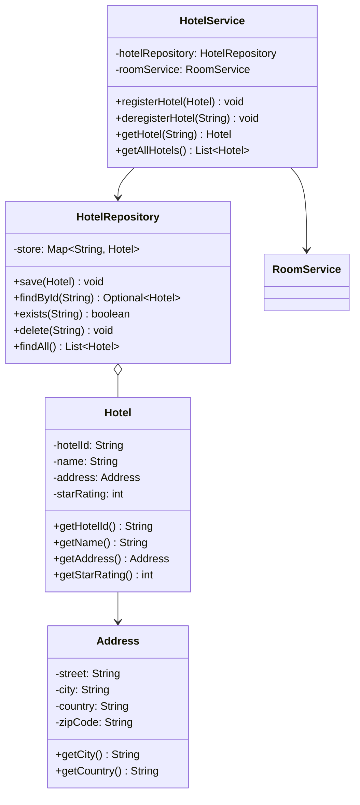
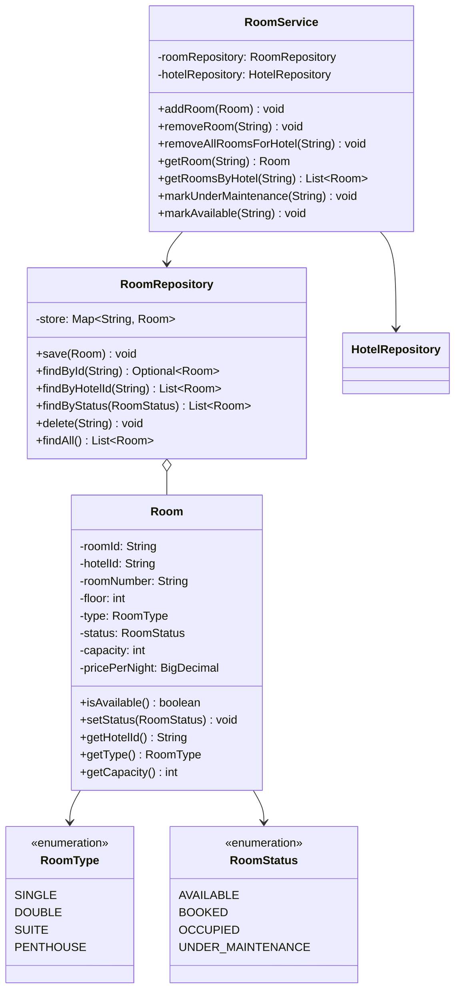
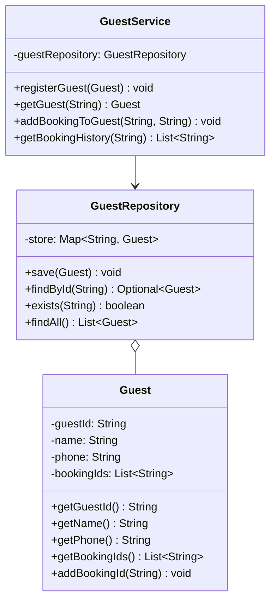
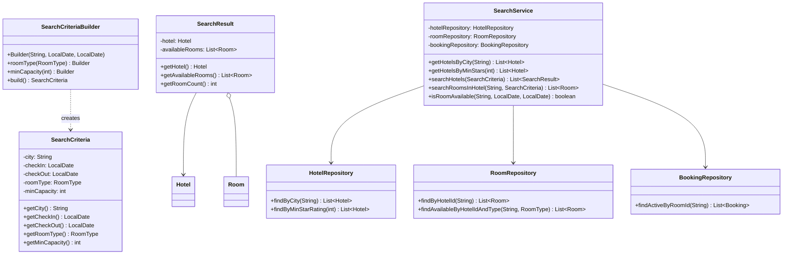
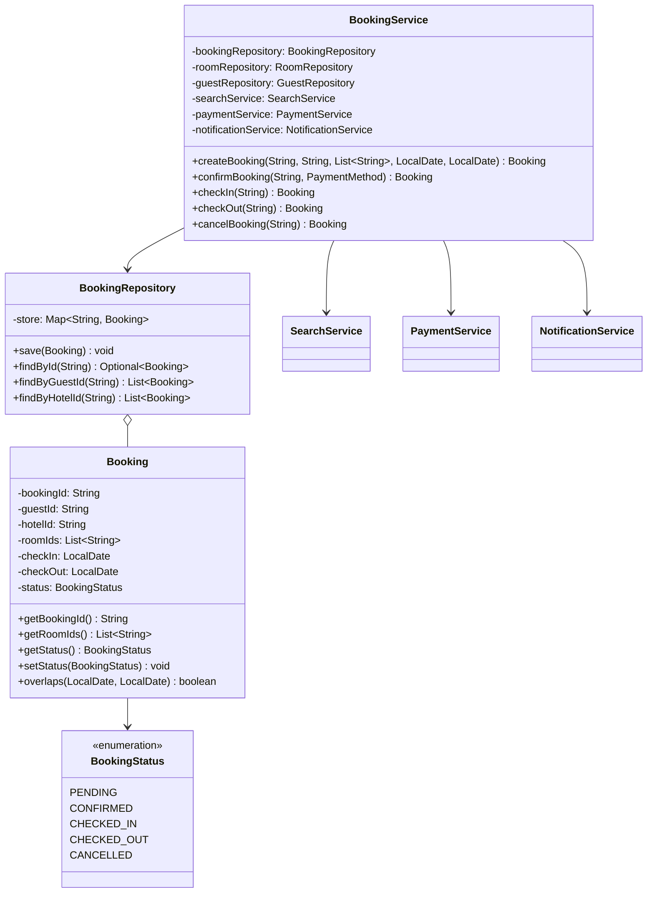
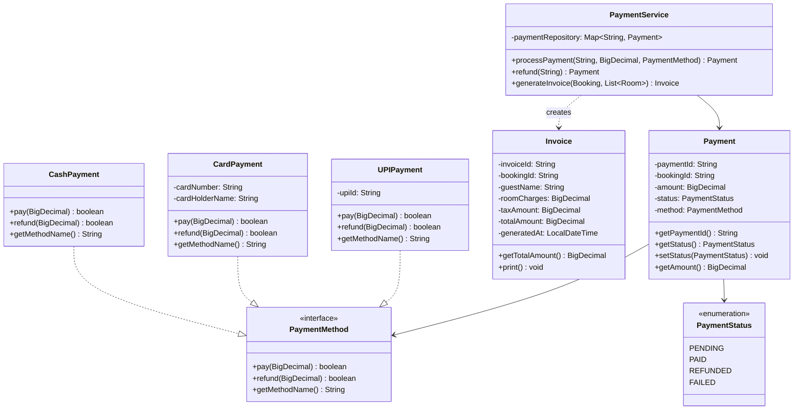
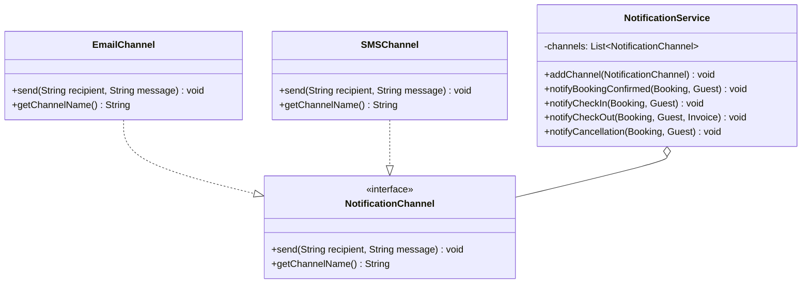
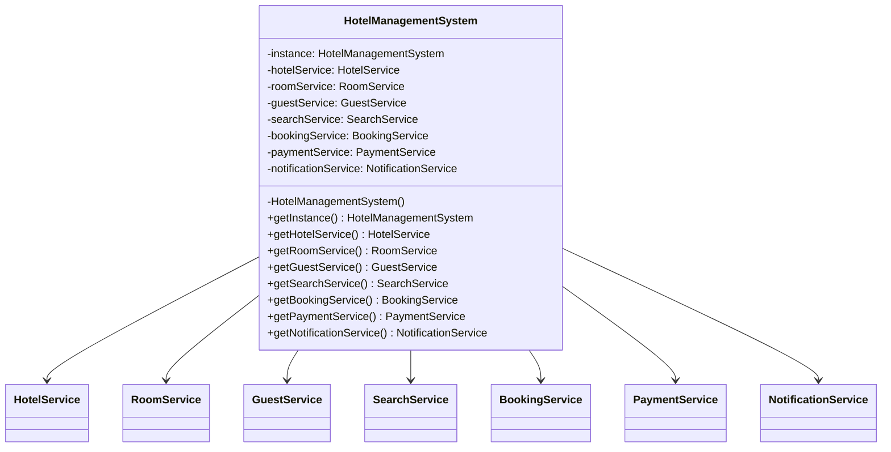

# Hotel Management System — Class Diagrams

---

## Component 1a: Hotel Management

> Responsibility: Hotel lifecycle only — register, deregister, fetch.
> Actor: Chain Admin.
> Rule: Does NOT touch rooms (that is RoomService). Does NOT query availability (that is SearchService).
>
> HotelRepository here shows only lifecycle methods.
> findByCity / findByMinStarRating are query methods — they appear only in Component 3 (Search).

---

## Component 1b: Room Management

> Responsibility: Room lifecycle only — add, remove, maintenance.
> Actor: Hotel Admin.
> Rule: Does NOT register hotels (that is HotelService). Does NOT answer availability (that is SearchService).
>
> RoomRepository here shows only lifecycle methods.
> findAvailableByHotelIdAndType is a query method — it appears only in Component 3 (Search).

---

## Component 2: Guest Management

> Responsibility: Guest lifecycle — register, fetch, booking history.
> Actor: Guest (self-registration), Front Desk (walk-in).

---

## Component 3: Search

> Responsibility: All discovery and availability queries.
> Actor: Guest.
> Rule: If the operation answers "what exists and is available?" it belongs here.
>
> Query methods from repositories are shown here — in the component that actually uses them:
>   HotelRepository.findByCity / findByMinStarRating   → used by SearchService only
>   RoomRepository.findAvailableByHotelIdAndType        → used by SearchService only
>   BookingRepository.findActiveByRoomId                → used by SearchService only

---

## Component 4: Booking Service

> Responsibility: Full booking lifecycle — create, confirm, check-in, check-out, cancel.
> Owns the BookingStatus FSM. Handles concurrency via sorted room locking.

---

## Component 5: Payment

> Responsibility: Charge, refund, invoice generation.
> Pattern: Strategy — PaymentMethod is an interface; Cash/Card/UPI are interchangeable strategies.

---

## Component 6: Notification

> Responsibility: Notify guests on booking events.
> Pattern: Observer — NotificationService holds a list of channels.
>          New channels (push, WhatsApp) plug in without changing the service.

---

## Component 7: HMS Facade (Singleton)

> Single entry point. Constructs and wires all repositories and services.
> Private constructor prevents external instantiation.
> Wiring order: RoomService first, then HotelService (cascade dependency).

---

## Complete System Class Diagram

```mermaid
classDiagram
    %% ── Enums ────────────────────────────────────────────────────────────────
    class RoomType {
        <<enumeration>>
        SINGLE
        DOUBLE
        SUITE
        PENTHOUSE
    }
    class RoomStatus {
        <<enumeration>>
        AVAILABLE
        BOOKED
        OCCUPIED
        UNDER_MAINTENANCE
    }
    class BookingStatus {
        <<enumeration>>
        PENDING
        CONFIRMED
        CHECKED_IN
        CHECKED_OUT
        CANCELLED
    }
    class PaymentStatus {
        <<enumeration>>
        PENDING
        PAID
        REFUNDED
        FAILED
    }

    %% ── Models ───────────────────────────────────────────────────────────────
    class Address {
        -street: String
        -city: String
        -country: String
        -zipCode: String
    }
    class Hotel {
        -hotelId: String
        -name: String
        -address: Address
        -starRating: int
    }
    class Room {
        -roomId: String
        -hotelId: String
        -floor: int
        -type: RoomType
        -status: RoomStatus
        -capacity: int
        -pricePerNight: BigDecimal
        +isAvailable() boolean
    }
    class Guest {
        -guestId: String
        -name: String
        -phone: String
        -bookingIds: List~String~
    }
    class Booking {
        -bookingId: String
        -guestId: String
        -hotelId: String
        -roomIds: List~String~
        -checkIn: LocalDate
        -checkOut: LocalDate
        -status: BookingStatus
        +overlaps(LocalDate, LocalDate) boolean
    }
    class Payment {
        -paymentId: String
        -bookingId: String
        -amount: BigDecimal
        -status: PaymentStatus
        -method: PaymentMethod
    }
    class Invoice {
        -invoiceId: String
        -bookingId: String
        -roomCharges: BigDecimal
        -taxAmount: BigDecimal
        -totalAmount: BigDecimal
    }
    class SearchCriteria {
        -city: String
        -checkIn: LocalDate
        -checkOut: LocalDate
        -roomType: RoomType
        -minCapacity: int
    }
    class SearchResult {
        -hotel: Hotel
        -availableRooms: List~Room~
    }

    %% ── Interfaces ───────────────────────────────────────────────────────────
    class PaymentMethod {
        <<interface>>
        +pay(BigDecimal) boolean
        +refund(BigDecimal) boolean
    }
    class NotificationChannel {
        <<interface>>
        +send(String, String) void
    }

    %% ── Implementations ──────────────────────────────────────────────────────
    class CashPayment { +pay(BigDecimal) boolean }
    class CardPayment { -cardNumber: String }
    class UPIPayment  { -upiId: String }
    class EmailChannel { +send(String, String) void }
    class SMSChannel   { +send(String, String) void }

    %% ── Repositories (all methods for complete picture) ─────────────────────
    class HotelRepository {
        +save(Hotel) void
        +findById(String) Optional~Hotel~
        +exists(String) boolean
        +delete(String) void
        +findAll() List~Hotel~
        +findByCity(String) List~Hotel~
        +findByMinStarRating(int) List~Hotel~
    }
    class RoomRepository {
        +save(Room) void
        +findById(String) Optional~Room~
        +findByHotelId(String) List~Room~
        +findByStatus(RoomStatus) List~Room~
        +delete(String) void
        +findAvailableByHotelIdAndType(String, RoomType) List~Room~
    }
    class GuestRepository {
        +save(Guest) void
        +findById(String) Optional~Guest~
    }
    class BookingRepository {
        +save(Booking) void
        +findById(String) Optional~Booking~
        +findActiveByRoomId(String) List~Booking~
        +findByGuestId(String) List~Booking~
    }

    %% ── Services ─────────────────────────────────────────────────────────────
    class HotelService {
        +registerHotel(Hotel) void
        +deregisterHotel(String) void
        +getHotel(String) Hotel
        +getAllHotels() List~Hotel~
    }
    class RoomService {
        +addRoom(Room) void
        +removeRoom(String) void
        +removeAllRoomsForHotel(String) void
        +getRoom(String) Room
        +getRoomsByHotel(String) List~Room~
        +markUnderMaintenance(String) void
        +markAvailable(String) void
    }
    class GuestService {
        +registerGuest(Guest) void
        +getGuest(String) Guest
        +addBookingToGuest(String, String) void
    }
    class SearchService {
        +getHotelsByCity(String) List~Hotel~
        +getHotelsByMinStars(int) List~Hotel~
        +searchHotels(SearchCriteria) List~SearchResult~
        +searchRoomsInHotel(String, SearchCriteria) List~Room~
        +isRoomAvailable(String, LocalDate, LocalDate) boolean
    }
    class BookingService {
        +createBooking(String, String, List~String~, LocalDate, LocalDate) Booking
        +confirmBooking(String, PaymentMethod) Booking
        +checkIn(String) Booking
        +checkOut(String) Booking
        +cancelBooking(String) Booking
    }
    class PaymentService {
        +processPayment(String, BigDecimal, PaymentMethod) Payment
        +refund(String) Payment
        +generateInvoice(Booking) Invoice
    }
    class NotificationService {
        +notifyBookingConfirmed(Booking, Guest) void
        +notifyCheckIn(Booking, Guest) void
        +notifyCheckOut(Booking, Guest, Invoice) void
        +notifyCancellation(Booking, Guest) void
    }

    %% ── Facade ───────────────────────────────────────────────────────────────
    class HotelManagementSystem {
        -instance: HotelManagementSystem
        +getInstance() HotelManagementSystem
    }

    %% ── Model Relationships ──────────────────────────────────────────────────
    Hotel        -->  Address
    Room         -->  RoomType
    Room         -->  RoomStatus
    Booking      -->  BookingStatus
    Payment      -->  PaymentStatus
    Payment      -->  PaymentMethod
    SearchResult -->  Hotel
    SearchResult o--  Room

    %% ── Interface Implementations ────────────────────────────────────────────
    CashPayment  ..|>  PaymentMethod
    CardPayment  ..|>  PaymentMethod
    UPIPayment   ..|>  PaymentMethod
    EmailChannel ..|>  NotificationChannel
    SMSChannel   ..|>  NotificationChannel

    %% ── Repository Ownership ─────────────────────────────────────────────────
    HotelRepository   o--  Hotel
    RoomRepository    o--  Room
    GuestRepository   o--  Guest
    BookingRepository o--  Booking

    %% ── Service Dependencies ─────────────────────────────────────────────────
    HotelService   -->  HotelRepository
    HotelService   -->  RoomService
    RoomService    -->  RoomRepository
    RoomService    -->  HotelRepository
    GuestService   -->  GuestRepository
    SearchService  -->  HotelRepository
    SearchService  -->  RoomRepository
    SearchService  -->  BookingRepository
    BookingService -->  BookingRepository
    BookingService -->  RoomRepository
    BookingService -->  GuestRepository
    BookingService -->  SearchService
    BookingService -->  PaymentService
    BookingService -->  NotificationService
    PaymentService ..>  Invoice : creates
    NotificationService o-- NotificationChannel

    %% ── Facade ───────────────────────────────────────────────────────────────
    HotelManagementSystem  -->  HotelService
    HotelManagementSystem  -->  RoomService
    HotelManagementSystem  -->  GuestService
    HotelManagementSystem  -->  SearchService
    HotelManagementSystem  -->  BookingService
    HotelManagementSystem  -->  PaymentService
    HotelManagementSystem  -->  NotificationService
```

