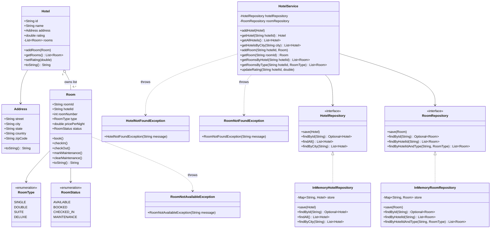
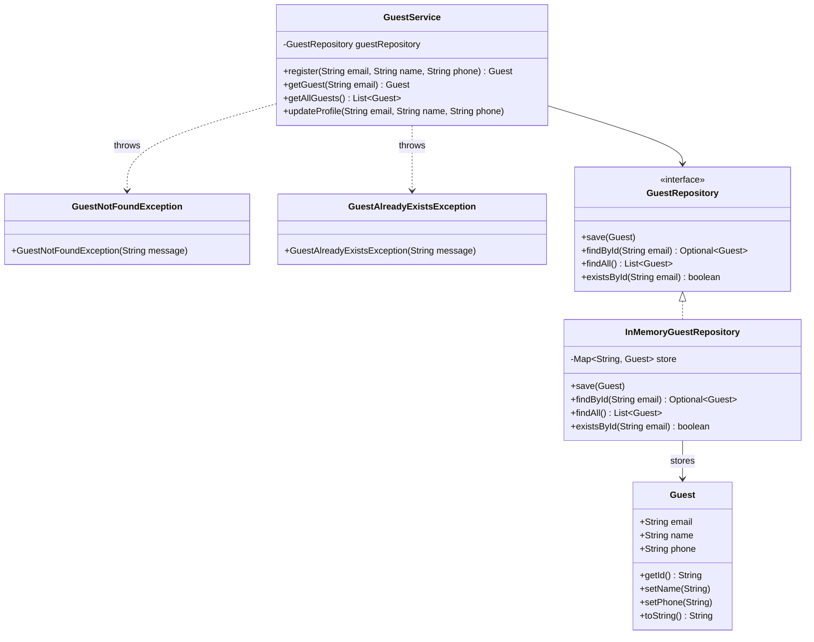
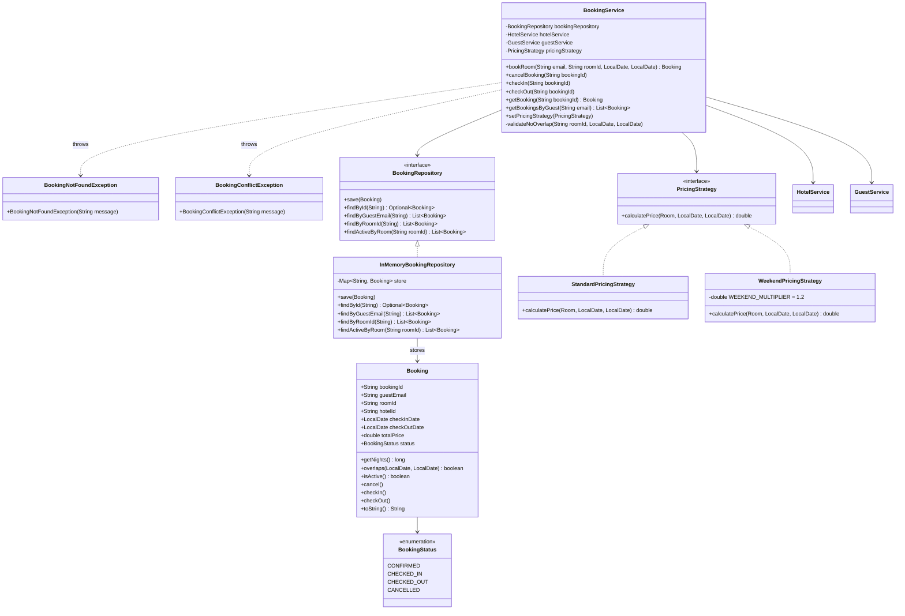
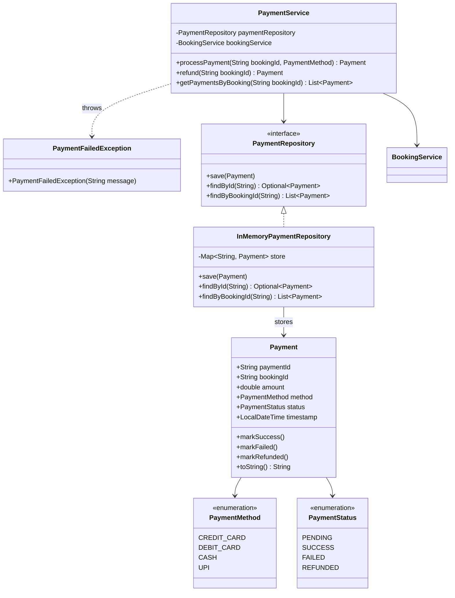
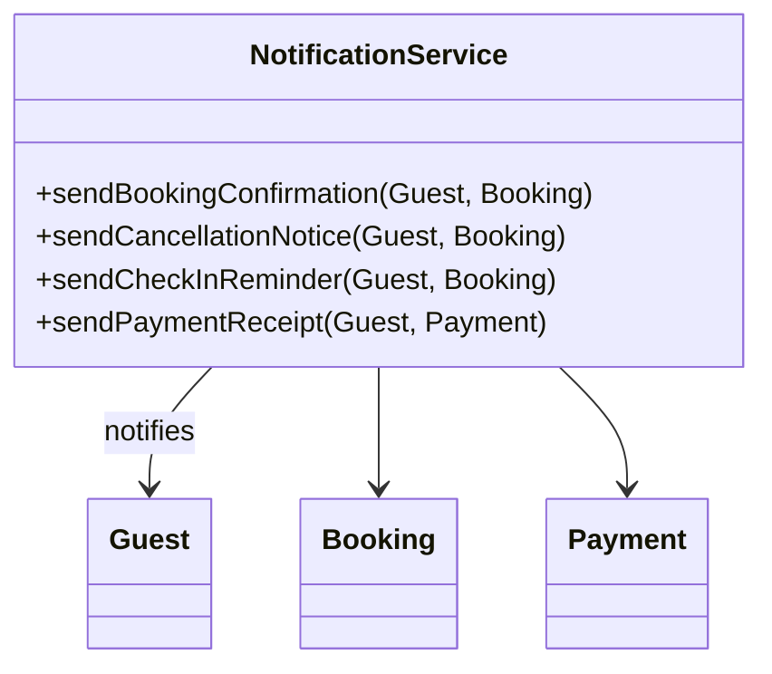
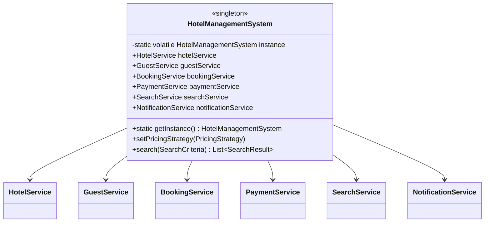

# Hotel Management System — Class Diagrams (Service-wise)

---

## Step 1 — HotelService



---

## Step 2 — GuestService



---

## Step 3 — BookingService



---

## Step 4 — PaymentService



---

## Step 5 — SearchService

```mermaid
classDiagram
    class SearchCriteria {
        +String city
        +Double minRating
        +RoomType roomType
        +LocalDate checkIn
        +LocalDate checkOut
        +builder() Builder
    }

    class Builder {
        +city(String) Builder
        +minRating(double) Builder
        +roomType(RoomType) Builder
        +checkIn(LocalDate) Builder
        +checkOut(LocalDate) Builder
        +build() SearchCriteria
    }

    class SearchResult {
        +Hotel hotel
        +Room room
        +getHotel() Hotel
        +getRoom() Room
        +toString() String
    }

    class SearchService {
        -HotelRepository hotelRepository
        -RoomRepository roomRepository
        -BookingRepository bookingRepository
        +search(SearchCriteria) List~SearchResult~
        -isAvailable(Room, SearchCriteria) boolean
    }

    SearchCriteria +-- Builder
    SearchResult --> Hotel
    SearchResult --> Room
    SearchService --> HotelRepository
    SearchService --> RoomRepository
    SearchService --> BookingRepository
    SearchService --> SearchCriteria
    SearchService --> SearchResult
```

---

## Step 6 — NotificationService



---

## Step 7 — HotelManagementSystem (Singleton)



---

## Step 8 — Full Combined Diagram

```mermaid
classDiagram
    class RoomType {
        <<enumeration>>
        SINGLE
        DOUBLE
        SUITE
        DELUXE
    }
    class RoomStatus {
        <<enumeration>>
        AVAILABLE
        BOOKED
        CHECKED_IN
        MAINTENANCE
    }
    class BookingStatus {
        <<enumeration>>
        CONFIRMED
        CHECKED_IN
        CHECKED_OUT
        CANCELLED
    }
    class PaymentMethod {
        <<enumeration>>
        CREDIT_CARD
        DEBIT_CARD
        CASH
        UPI
    }
    class PaymentStatus {
        <<enumeration>>
        PENDING
        SUCCESS
        FAILED
        REFUNDED
    }
    class Address {
        +String street
        +String city
        +String state
        +String country
        +String zipCode
    }
    class Hotel {
        +String id
        +String name
        +Address address
        +double rating
        -List~Room~ rooms
        +addRoom(Room)
        +getRooms() List~Room~
        +setRating(double)
    }
    class Room {
        +String roomId
        +String hotelId
        +int roomNumber
        +RoomType type
        +double pricePerNight
        +RoomStatus status
        +book()
        +checkIn()
        +checkOut()
        +markMaintenance()
        +clearMaintenance()
    }
    class Guest {
        +String email
        +String name
        +String phone
        +getId() String
    }
    class Booking {
        +String bookingId
        +String guestEmail
        +String roomId
        +String hotelId
        +LocalDate checkInDate
        +LocalDate checkOutDate
        +double totalPrice
        +BookingStatus status
        +getNights() long
        +overlaps(LocalDate, LocalDate) boolean
        +isActive() boolean
        +cancel()
        +checkIn()
        +checkOut()
    }
    class Payment {
        +String paymentId
        +String bookingId
        +double amount
        +PaymentMethod method
        +PaymentStatus status
        +LocalDateTime timestamp
        +markSuccess()
        +markFailed()
        +markRefunded()
    }
    class HotelRepository {
        <<interface>>
        +save(Hotel)
        +findById(String) Optional~Hotel~
        +findAll() List~Hotel~
        +findByCity(String) List~Hotel~
    }
    class InMemoryHotelRepository {
        -Map~String, Hotel~ store
    }
    class RoomRepository {
        <<interface>>
        +save(Room)
        +findById(String) Optional~Room~
        +findByHotelId(String) List~Room~
        +findByHotelIdAndType(String, RoomType) List~Room~
    }
    class InMemoryRoomRepository {
        -Map~String, Room~ store
    }
    class GuestRepository {
        <<interface>>
        +save(Guest)
        +findById(String) Optional~Guest~
        +findAll() List~Guest~
        +existsById(String) boolean
    }
    class InMemoryGuestRepository {
        -Map~String, Guest~ store
    }
    class BookingRepository {
        <<interface>>
        +save(Booking)
        +findById(String) Optional~Booking~
        +findByGuestEmail(String) List~Booking~
        +findByRoomId(String) List~Booking~
        +findActiveByRoom(String) List~Booking~
    }
    class InMemoryBookingRepository {
        -Map~String, Booking~ store
    }
    class PaymentRepository {
        <<interface>>
        +save(Payment)
        +findById(String) Optional~Payment~
        +findByBookingId(String) List~Payment~
    }
    class InMemoryPaymentRepository {
        -Map~String, Payment~ store
    }
    class PricingStrategy {
        <<interface>>
        +calculatePrice(Room, LocalDate, LocalDate) double
    }
    class StandardPricingStrategy {
        +calculatePrice(Room, LocalDate, LocalDate) double
    }
    class WeekendPricingStrategy {
        -double WEEKEND_MULTIPLIER = 1.2
        +calculatePrice(Room, LocalDate, LocalDate) double
    }
    class SearchCriteria {
        +String city
        +Double minRating
        +RoomType roomType
        +LocalDate checkIn
        +LocalDate checkOut
    }
    class Builder {
        +city(String) Builder
        +minRating(double) Builder
        +roomType(RoomType) Builder
        +checkIn(LocalDate) Builder
        +checkOut(LocalDate) Builder
        +build() SearchCriteria
    }
    class SearchResult {
        +Hotel hotel
        +Room room
    }
    class HotelService {
        -HotelRepository hotelRepository
        -RoomRepository roomRepository
        +addHotel(Hotel)
        +getHotel(String) Hotel
        +getAllHotels() List~Hotel~
        +getHotelsByCity(String) List~Hotel~
        +addRoom(String, Room)
        +getRoom(String) Room
        +getRoomsByHotel(String) List~Room~
        +updateRating(String, double)
    }
    class GuestService {
        -GuestRepository guestRepository
        +register(String, String, String) Guest
        +getGuest(String) Guest
        +getAllGuests() List~Guest~
        +updateProfile(String, String, String)
    }
    class BookingService {
        -BookingRepository bookingRepository
        -HotelService hotelService
        -GuestService guestService
        -PricingStrategy pricingStrategy
        +bookRoom(String, String, LocalDate, LocalDate) Booking
        +cancelBooking(String)
        +checkIn(String)
        +checkOut(String)
        +getBooking(String) Booking
        +getBookingsByGuest(String) List~Booking~
        +setPricingStrategy(PricingStrategy)
        -validateNoOverlap(String, LocalDate, LocalDate)
    }
    class PaymentService {
        -PaymentRepository paymentRepository
        -BookingService bookingService
        +processPayment(String, PaymentMethod) Payment
        +refund(String) Payment
        +getPaymentsByBooking(String) List~Payment~
    }
    class SearchService {
        -HotelRepository hotelRepository
        -RoomRepository roomRepository
        -BookingRepository bookingRepository
        +search(SearchCriteria) List~SearchResult~
        -isAvailable(Room, SearchCriteria) boolean
    }
    class NotificationService {
        +sendBookingConfirmation(Guest, Booking)
        +sendCancellationNotice(Guest, Booking)
        +sendCheckInReminder(Guest, Booking)
        +sendPaymentReceipt(Guest, Payment)
    }
    class HotelManagementSystem {
        <<singleton>>
        -static volatile HotelManagementSystem instance
        +HotelService hotelService
        +GuestService guestService
        +BookingService bookingService
        +PaymentService paymentService
        +SearchService searchService
        +NotificationService notificationService
        +static getInstance() HotelManagementSystem
        +setPricingStrategy(PricingStrategy)
        +search(SearchCriteria) List~SearchResult~
    }

    Hotel "1" o-- "0..*" Room : owns list
    Hotel --> Address
    Room --> RoomType
    Room --> RoomStatus
    Booking --> BookingStatus
    Payment --> PaymentMethod
    Payment --> PaymentStatus
    HotelRepository <|.. InMemoryHotelRepository
    RoomRepository <|.. InMemoryRoomRepository
    GuestRepository <|.. InMemoryGuestRepository
    BookingRepository <|.. InMemoryBookingRepository
    PaymentRepository <|.. InMemoryPaymentRepository
    PricingStrategy <|.. StandardPricingStrategy
    PricingStrategy <|.. WeekendPricingStrategy
    SearchCriteria +-- Builder
    SearchResult --> Hotel
    SearchResult --> Room
    HotelService --> HotelRepository
    HotelService --> RoomRepository
    GuestService --> GuestRepository
    BookingService --> BookingRepository
    BookingService --> HotelService
    BookingService --> GuestService
    BookingService --> PricingStrategy
    PaymentService --> PaymentRepository
    PaymentService --> BookingService
    SearchService --> HotelRepository
    SearchService --> RoomRepository
    SearchService --> BookingRepository
    NotificationService --> Guest
    NotificationService --> Booking
    NotificationService --> Payment
    HotelManagementSystem --> HotelService
    HotelManagementSystem --> GuestService
    HotelManagementSystem --> BookingService
    HotelManagementSystem --> PaymentService
    HotelManagementSystem --> SearchService
    HotelManagementSystem --> NotificationService
```
