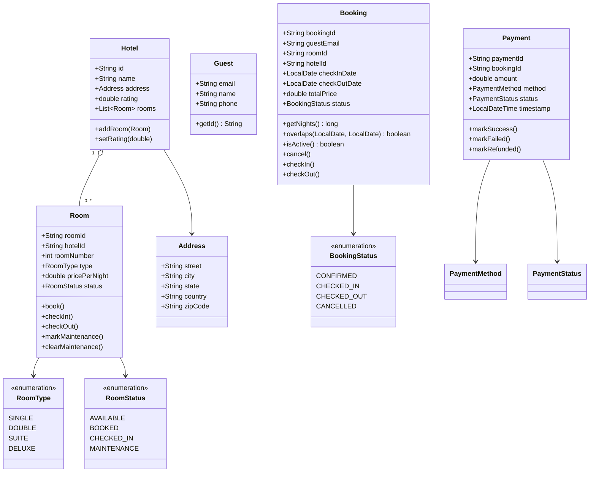
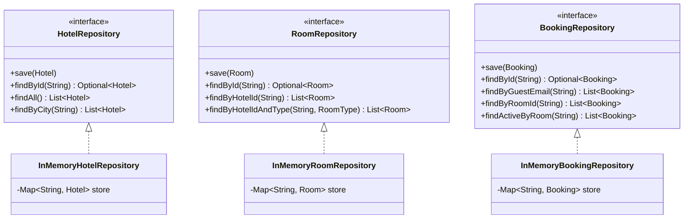
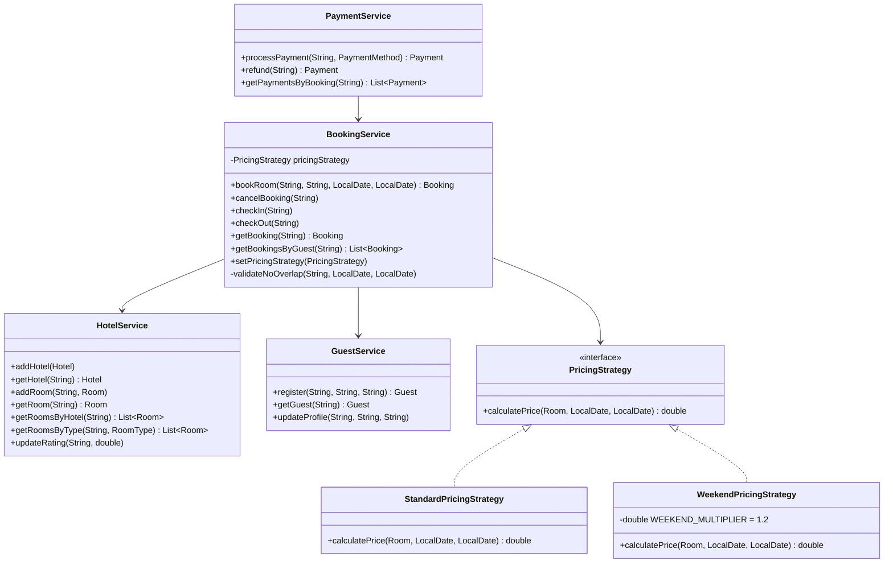
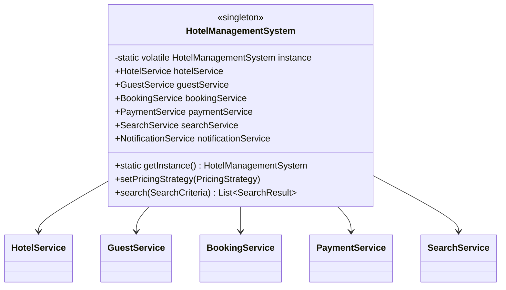
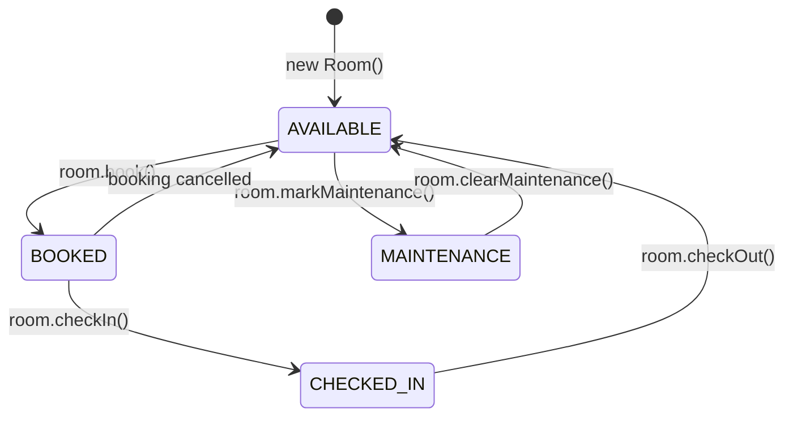
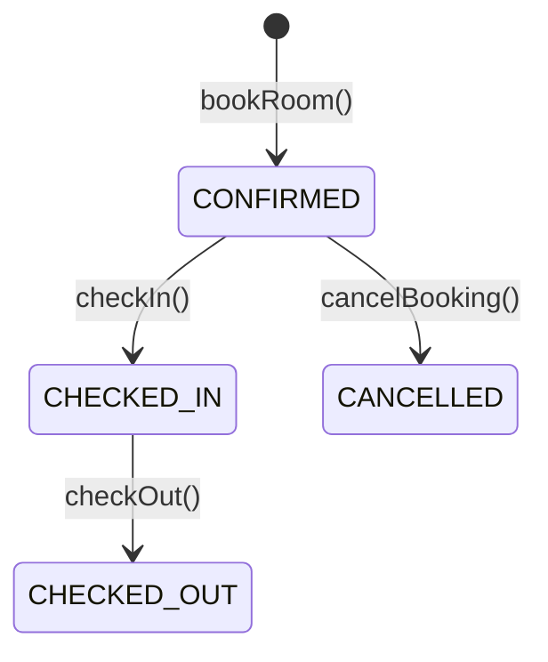

# Hotel Management System — LLD

## Requirements

### Core Entities
| Entity | Description |
|--------|-------------|
| **Hotel** | Has multiple rooms; belongs to a city; has a rating |
| **Room** | Belongs to one hotel; has a type, price/night, and status |
| **Guest** | Identified by email (unique identity) |
| **Booking** | Reserves a room for a date range; tracks status |
| **Payment** | Settles a booking; one payment per booking |

### Functional
- System manages **multiple hotels** across cities
- Room status: `AVAILABLE → BOOKED → CHECKED_IN → AVAILABLE` (or `MAINTENANCE`)
- Guest books a room; system validates **no date overlap** with existing active bookings
- Check-in/check-out are explicit transitions on both `Room` and `Booking`
- **PricingStrategy** — pluggable: standard (nights × rate) or weekend (1.2× on Fri/Sat)
- **SearchService** spans all hotels — filters by city → minRating → roomType → date availability
- `HotelManagementSystem` is a **singleton** facade — single entry point

---

## Design Patterns Used

| Pattern | Where |
|---------|-------|
| **Strategy** | `PricingStrategy` — swap Standard ↔ Weekend at runtime |
| **Repository** | Interface + InMemory impl per aggregate root |
| **Facade** | `HotelManagementSystem` wires all repos + services |
| **Builder** | `SearchCriteria.Builder` — optional fields, immutable result |
| **Singleton** | `HotelManagementSystem` — double-checked locking with `volatile` |

---

## Package Structure

```
hotel/
├── HotelManagementSystem.java   ← facade singleton
├── Main.java                    ← demo entry point
├── model/
│   ├── Address.java
│   ├── Hotel.java
│   ├── Room.java                ← owns state transitions
│   ├── RoomType.java            ← SINGLE, DOUBLE, SUITE, DELUXE
│   ├── RoomStatus.java          ← AVAILABLE, BOOKED, CHECKED_IN, MAINTENANCE
│   ├── Guest.java               ← email = unique id
│   ├── Booking.java             ← overlaps() for date math
│   ├── BookingStatus.java       ← CONFIRMED, CHECKED_IN, CHECKED_OUT, CANCELLED
│   ├── Payment.java
│   ├── PaymentMethod.java       ← CREDIT_CARD, DEBIT_CARD, CASH, UPI
│   └── PaymentStatus.java       ← PENDING, SUCCESS, FAILED, REFUNDED
├── exception/
│   ├── HotelNotFoundException.java
│   ├── RoomNotFoundException.java
│   ├── RoomNotAvailableException.java
│   ├── GuestNotFoundException.java
│   ├── GuestAlreadyExistsException.java
│   ├── BookingNotFoundException.java
│   ├── BookingConflictException.java
│   └── PaymentFailedException.java
├── repository/
│   ├── HotelRepository.java          ← interface
│   ├── InMemoryHotelRepository.java
│   ├── RoomRepository.java
│   ├── InMemoryRoomRepository.java
│   ├── GuestRepository.java
│   ├── InMemoryGuestRepository.java
│   ├── BookingRepository.java        ← findActiveByRoom() is the key query
│   ├── InMemoryBookingRepository.java
│   ├── PaymentRepository.java
│   └── InMemoryPaymentRepository.java
├── pricing/
│   ├── PricingStrategy.java          ← interface
│   ├── StandardPricingStrategy.java  ← nights × pricePerNight
│   └── WeekendPricingStrategy.java   ← 1.2× on Fri/Sat nights
├── search/
│   ├── SearchCriteria.java           ← Builder pattern
│   ├── SearchResult.java             ← (Hotel, Room) tuple
│   └── SearchService.java            ← filter chain across all hotels
├── service/
│   ├── HotelService.java
│   ├── GuestService.java
│   ├── BookingService.java           ← validateNoOverlap() before room.book()
│   └── PaymentService.java
└── notification/
    └── NotificationService.java      ← console stub
```

---

## Class Diagrams

### Models



---

### Repository Layer



---

### Service + Pricing Layer



---

### Search

```mermaid
classDiagram
    class SearchCriteria {
        +String city
        +Double minRating
        +RoomType roomType
        +LocalDate checkIn
        +LocalDate checkOut
    }

    class SearchCriteria_Builder {
        +city(String) Builder
        +minRating(double) Builder
        +roomType(RoomType) Builder
        +checkIn(LocalDate) Builder
        +checkOut(LocalDate) Builder
        +build() SearchCriteria
    }

    class SearchResult {
        +Hotel hotel
        +Room room
    }

    class SearchService {
        +search(SearchCriteria) List~SearchResult~
        -isAvailable(Room, SearchCriteria) boolean
    }

    SearchCriteria +-- SearchCriteria_Builder
    SearchService --> SearchCriteria
    SearchService --> SearchResult
    SearchService --> HotelRepository
    SearchService --> RoomRepository
    SearchService --> BookingRepository
```

---

### Singleton Facade



---

### Room State Machine



---

### Booking Lifecycle



---

## Key Design Decisions

### 1. `Room` owns its own state transitions
`Room.book()`, `.checkIn()`, `.checkOut()` throw `RoomNotAvailableException` if called in the wrong state — the model enforces the FSM, services don't manage raw status strings.

### 2. Overlap detection in `Booking`
```java
public boolean overlaps(LocalDate checkIn, LocalDate checkOut) {
    return checkIn.isBefore(checkOutDate) && checkOut.isAfter(checkInDate);
}
```
`BookingService.validateNoOverlap()` queries `findActiveByRoom()` (CONFIRMED + CHECKED_IN only) before calling `room.book()`.

### 3. Strategy pattern for pricing
```java
hms.setPricingStrategy(new WeekendPricingStrategy());
```
`WeekendPricingStrategy` iterates day-by-day and applies 1.2× on Friday and Saturday nights.

### 4. Builder for search criteria
All fields are optional — city, minRating, roomType, checkIn/checkOut can be combined freely:
```java
SearchCriteria criteria = new SearchCriteria.Builder()
    .city("Bangalore")
    .minRating(4.0)
    .roomType(RoomType.DOUBLE)
    .checkIn(checkIn).checkOut(checkOut)
    .build();
```

### 5. Double-checked locking singleton
```java
private static volatile HotelManagementSystem instance;

public static HotelManagementSystem getInstance() {
    if (instance == null) {
        synchronized (HotelManagementSystem.class) {
            if (instance == null) {
                instance = new HotelManagementSystem();
            }
        }
    }
    return instance;
}
```
`volatile` prevents CPU instruction reordering during object construction.

---

## Build & Run

```bash
# from HotelManagementSystem/code/
mkdir -p out
find src -name "*.java" | xargs javac -d out
java -cp out hotel.Main
```

### Expected output
```
Registered: Guest{email='alice@example.com', name='Alice', ...}
Registered: Guest{email='bob@example.com', name='Bob', ...}

=== Search Results ===
SearchResult{hotel='The Grand Bangalore', room=Room{...type=DOUBLE...status=AVAILABLE}}

Booked: Booking{...guest='alice@example.com', room='R102', 2026-10-01 → 2026-10-05, status=CONFIRMED}
[NOTIFICATION] Booking confirmed for Alice | ...

Expected conflict: Room R102 is already booked for the requested dates
[NOTIFICATION] Payment receipt for Alice | Amount: $16000.00 | Method: CREDIT_CARD | Status: SUCCESS

Checked in.  Room status: CHECKED_IN
Checked out. Room status: AVAILABLE
Booking status: CHECKED_OUT

Weekend booking: Booking{...2026-10-09 → 2026-10-11, status=CONFIRMED}
Weekend price (2 nights × 4000 × 1.2): $9600.0

Suite R201 status: MAINTENANCE

=== All done ===
```
