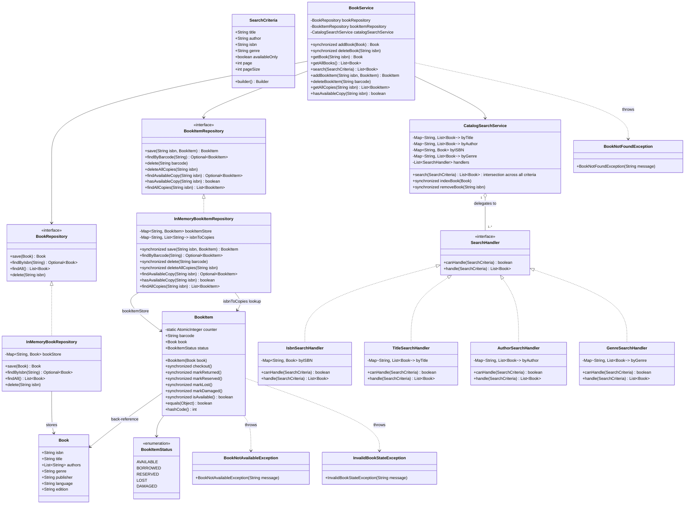
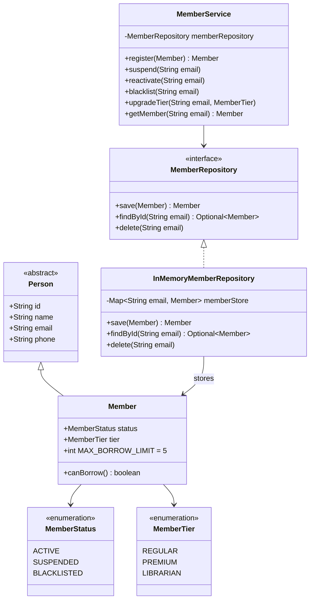
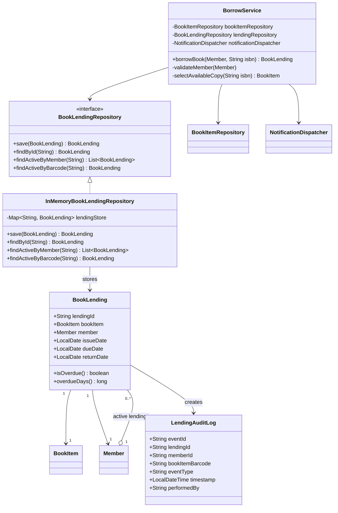
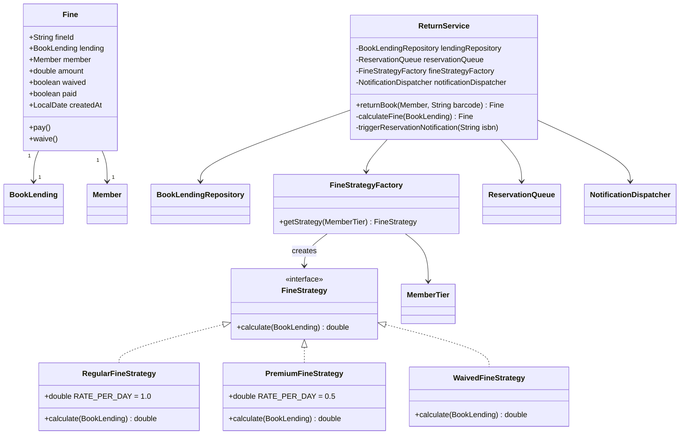
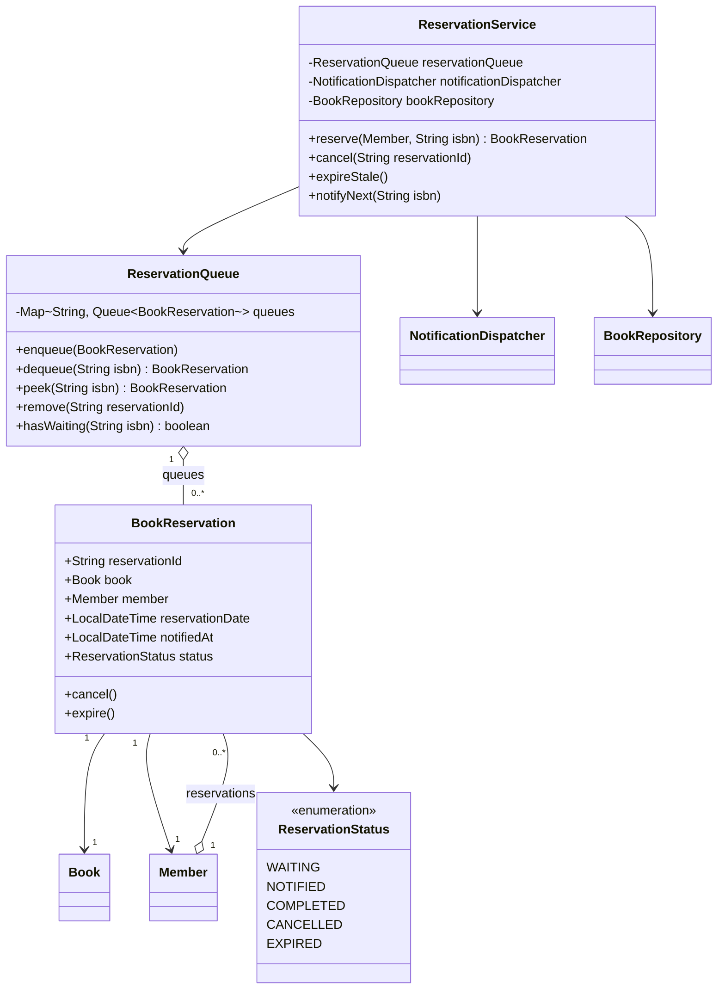
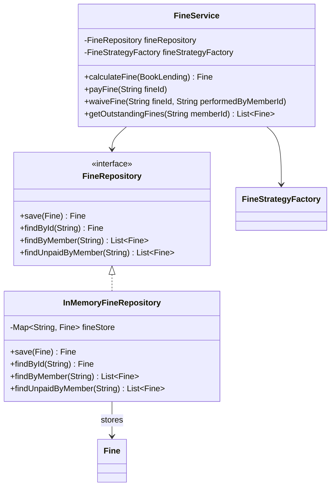
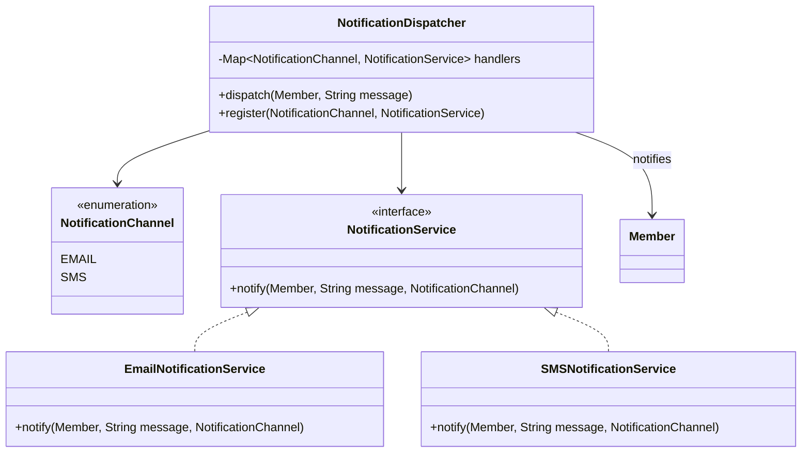
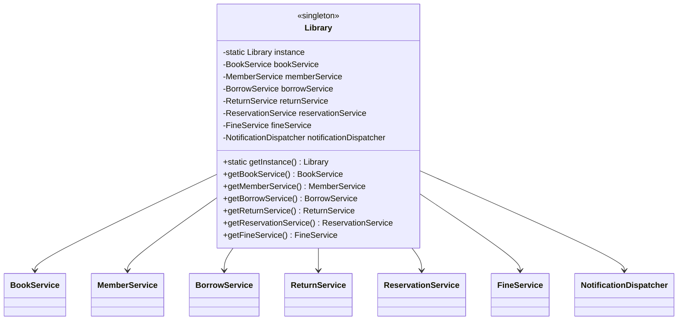

# Library Management System — Class Diagrams (Service-wise)

---

## Step 1 — BookService

---

## Step 2 — MemberService

---

## Step 3 — BorrowService

---

## Step 4 — ReturnService

---

## Step 5 — ReservationService

---

## Step 6 — FineService

---

## Step 7 — NotificationService

---

## Step 8 — Library (Entry Point)

---

## Step 9 — Full Combined Diagram

```mermaid
classDiagram
    class BookItemStatus {
        <<enumeration>>
        AVAILABLE
        BORROWED
        RESERVED
        LOST
        DAMAGED
    }
    class MemberStatus {
        <<enumeration>>
        ACTIVE
        SUSPENDED
        BLACKLISTED
    }
    class MemberTier {
        <<enumeration>>
        REGULAR
        PREMIUM
        LIBRARIAN
    }
    class ReservationStatus {
        <<enumeration>>
        WAITING
        NOTIFIED
        COMPLETED
        CANCELLED
        EXPIRED
    }
    class NotificationChannel {
        <<enumeration>>
        EMAIL
        SMS
    }
    class Book {
        +String isbn
        +String title
        +List~String~ authors
        +String genre
        +String publisher
        +String language
        +String edition
    }
    class BookItem {
        -static AtomicInteger counter
        +String barcode
        +Book book
        +BookItemStatus status
        +synchronized checkout()
        +synchronized markReturned()
        +synchronized markReserved()
        +synchronized markLost()
        +synchronized markDamaged()
        +synchronized isAvailable() boolean
        +equals(Object) boolean
        +hashCode() int
    }
    class BookNotAvailableException {
        +BookNotAvailableException(String message)
    }
    class InvalidBookStateException {
        +InvalidBookStateException(String message)
    }
    class BookNotFoundException {
        +BookNotFoundException(String message)
    }
    class BookRepository {
        <<interface>>
        +save(Book) Book
        +findByIsbn(String) Optional~Book~
        +findAll() List~Book~
        +delete(String isbn)
    }
    class InMemoryBookRepository {
        -Map~String, Book~ bookStore
        +save(Book) Book
        +findByIsbn(String) Optional~Book~
        +findAll() List~Book~
        +delete(String isbn)
    }
    class BookItemRepository {
        <<interface>>
        +save(String isbn, BookItem) BookItem
        +findByBarcode(String) Optional~BookItem~
        +delete(String barcode)
        +deleteAllCopies(String isbn)
        +findAvailableCopy(String isbn) Optional~BookItem~
        +hasAvailableCopy(String isbn) boolean
        +findAllCopies(String isbn) List~BookItem~
    }
    class InMemoryBookItemRepository {
        -Map~String, BookItem~ bookItemStore
        -Map~String, List~String~~ isbnToCopies
        +synchronized save(String isbn, BookItem) BookItem
        +findByBarcode(String) Optional~BookItem~
        +synchronized delete(String barcode)
        +synchronized deleteAllCopies(String isbn)
        +findAvailableCopy(String isbn) Optional~BookItem~
        +hasAvailableCopy(String isbn) boolean
        +findAllCopies(String isbn) List~BookItem~
    }
    class SearchCriteria {
        +String title
        +String author
        +String isbn
        +String genre
        +boolean availableOnly
        +int page
        +int pageSize
    }
    class SearchHandler {
        <<interface>>
        +canHandle(SearchCriteria) boolean
        +handle(SearchCriteria) List~Book~
    }
    class IsbnSearchHandler {
        -Map~String, Book~ byISBN
        +canHandle(SearchCriteria) boolean
        +handle(SearchCriteria) List~Book~
    }
    class TitleSearchHandler {
        -Map~String, List~Book~~ byTitle
        +canHandle(SearchCriteria) boolean
        +handle(SearchCriteria) List~Book~
    }
    class AuthorSearchHandler {
        -Map~String, List~Book~~ byAuthor
        +canHandle(SearchCriteria) boolean
        +handle(SearchCriteria) List~Book~
    }
    class GenreSearchHandler {
        -Map~String, List~Book~~ byGenre
        +canHandle(SearchCriteria) boolean
        +handle(SearchCriteria) List~Book~
    }
    class CatalogSearchService {
        -Map~String, List~Book~~ byTitle
        -Map~String, List~Book~~ byAuthor
        -Map~String, Book~ byISBN
        -Map~String, List~Book~~ byGenre
        -List~SearchHandler~ handlers
        +search(SearchCriteria) List~Book~
        +synchronized indexBook(Book)
        +synchronized removeBook(String isbn)
    }
    class BookService {
        -BookRepository bookRepository
        -BookItemRepository bookItemRepository
        -CatalogSearchService catalogSearchService
        +synchronized addBook(Book) Book
        +synchronized deleteBook(String isbn)
        +getBook(String isbn) Book
        +getAllBooks() List~Book~
        +search(SearchCriteria) List~Book~
        +addBookItem(String isbn, BookItem) BookItem
        +deleteBookItem(String barcode)
        +getAllCopies(String isbn) List~BookItem~
        +hasAvailableCopy(String isbn) boolean
    }
    class Person {
        <<abstract>>
        +String id
        +String name
        +String email
        +String phone
    }
    class Member {
        +MemberStatus status
        +MemberTier tier
        +int MAX_BORROW_LIMIT = 5
        +canBorrow() boolean
        %% fine check is FineService's responsibility, not Member's
    }
    class MemberRepository {
        <<interface>>
        +save(Member) Member
        +findById(String email) Optional~Member~
        +delete(String email)
    }
    class InMemoryMemberRepository {
        -Map~String, Member~ memberStore
        +save(Member) Member
        +findById(String) Optional~Member~
        +findByEmail(String) Optional~Member~
    }
    class MemberService {
        -MemberRepository memberRepository
        +register(Member) Member
        +suspend(String memberId)
        +reactivate(String memberId)
        +blacklist(String memberId)
    }
    class BookLending {
        +String lendingId
        +LocalDate issueDate
        +LocalDate dueDate
        +LocalDate returnDate
        +isOverdue() boolean
        +overdueDays() long
    }
    class LendingAuditLog {
        +String eventId
        +String eventType
        +LocalDateTime timestamp
        +String performedBy
    }
    class BookLendingRepository {
        <<interface>>
        +save(BookLending) BookLending
        +findById(String) BookLending
        +findActiveByMember(String) List~BookLending~
        +findActiveByBarcode(String) BookLending
    }
    class InMemoryBookLendingRepository {
        -Map~String, BookLending~ lendingStore
        +save(BookLending) BookLending
        +findActiveByBarcode(String) BookLending
    }
    class BorrowService {
        +borrowBook(Member, String isbn) BookLending
        -validateMember(Member)
        -selectAvailableCopy(String isbn) BookItem
    }
    class Fine {
        +String fineId
        +double amount
        +boolean waived
        +boolean paid
        +pay()
        +waive()
    }
    class FineStrategy {
        <<interface>>
        +calculate(BookLending) double
    }
    class RegularFineStrategy {
        +double RATE_PER_DAY = 1.0
        +calculate(BookLending) double
    }
    class PremiumFineStrategy {
        +double RATE_PER_DAY = 0.5
        +calculate(BookLending) double
    }
    class WaivedFineStrategy {
        +calculate(BookLending) double
    }
    class FineStrategyFactory {
        +getStrategy(MemberTier) FineStrategy
    }
    class FineRepository {
        <<interface>>
        +save(Fine) Fine
        +findUnpaidByMember(String) List~Fine~
    }
    class InMemoryFineRepository {
        -Map~String, Fine~ fineStore
        +save(Fine) Fine
        +findUnpaidByMember(String) List~Fine~
    }
    class FineService {
        +calculateFine(BookLending) Fine
        +payFine(String fineId)
        +waiveFine(String fineId, String performedByMemberId)
    }
    class ReturnService {
        +returnBook(Member, String barcode) Fine
        -triggerReservationNotification(String isbn)
    }
    class BookReservation {
        +String reservationId
        +LocalDateTime reservationDate
        +LocalDateTime notifiedAt
        +ReservationStatus status
        +cancel()
        +expire()
    }
    class ReservationQueue {
        +enqueue(BookReservation)
        +dequeue(String isbn) BookReservation
        +remove(String reservationId)
        +hasWaiting(String isbn) boolean
    }
    class ReservationService {
        +reserve(Member, String isbn) BookReservation
        +cancel(String reservationId)
        +expireStale()
        +notifyNext(String isbn)
    }
    class NotificationService {
        <<interface>>
        +notify(Member, String, NotificationChannel)
    }
    class EmailNotificationService {
        +notify(Member, String, NotificationChannel)
    }
    class SMSNotificationService {
        +notify(Member, String, NotificationChannel)
    }
    class NotificationDispatcher {
        +dispatch(Member, String message)
        +register(NotificationChannel, NotificationService)
    }
    class Library {
        <<singleton>>
        -static Library instance
        +static getInstance() Library
    }

    BookItem --> Book : back-reference
    BookItem --> BookItemStatus
    BookItem ..> BookNotAvailableException : throws
    BookItem ..> InvalidBookStateException : throws
    BookRepository <|.. InMemoryBookRepository
    BookItemRepository <|.. InMemoryBookItemRepository
    InMemoryBookRepository --> Book : stores
    InMemoryBookItemRepository --> BookItem : bookItemStore
    InMemoryBookItemRepository --> BookItem : isbnToCopies
    SearchHandler <|.. IsbnSearchHandler
    SearchHandler <|.. TitleSearchHandler
    SearchHandler <|.. AuthorSearchHandler
    SearchHandler <|.. GenreSearchHandler
    CatalogSearchService "1" o-- "1..*" SearchHandler : delegates to
    BookService --> BookRepository
    BookService --> BookItemRepository
    BookService --> CatalogSearchService
    BookService ..> BookNotFoundException : throws
    Person <|-- Member
    Member --> MemberStatus
    Member --> MemberTier
    MemberRepository <|.. InMemoryMemberRepository
    MemberService --> MemberRepository
    BookLendingRepository <|.. InMemoryBookLendingRepository
    BookLending "1" --> "1" BookItem
    BookLending "1" --> "1" Member
    BookLending --> LendingAuditLog : creates
    Member "1" o-- "0..*" BookLending
    BorrowService --> BookItemRepository
    BorrowService --> BookLendingRepository
    BorrowService --> NotificationDispatcher
    FineStrategy <|.. RegularFineStrategy
    FineStrategy <|.. PremiumFineStrategy
    FineStrategy <|.. WaivedFineStrategy
    FineStrategyFactory --> FineStrategy
    FineStrategyFactory --> MemberTier
    Fine "1" --> "1" BookLending
    Fine "1" --> "1" Member
    FineRepository <|.. InMemoryFineRepository
    FineService --> FineRepository
    FineService --> FineStrategyFactory
    ReturnService --> BookLendingRepository
    ReturnService --> FineStrategyFactory
    ReturnService --> ReservationQueue
    ReturnService --> NotificationDispatcher
    BookReservation "1" --> "1" Book
    BookReservation "1" --> "1" Member
    BookReservation --> ReservationStatus
    ReservationQueue "1" o-- "0..*" BookReservation
    Member "1" o-- "0..*" BookReservation
    ReservationService --> ReservationQueue
    ReservationService --> NotificationDispatcher
    ReservationService --> BookRepository
    NotificationService <|.. EmailNotificationService
    NotificationService <|.. SMSNotificationService
    NotificationDispatcher --> NotificationService
    NotificationDispatcher --> NotificationChannel
    Library --> BookService
    Library --> MemberService
    Library --> BorrowService
    Library --> ReturnService
    Library --> ReservationService
    Library --> FineService
    Library --> NotificationDispatcher
```

