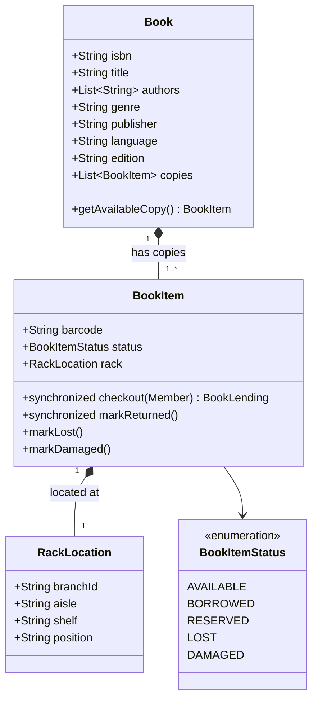
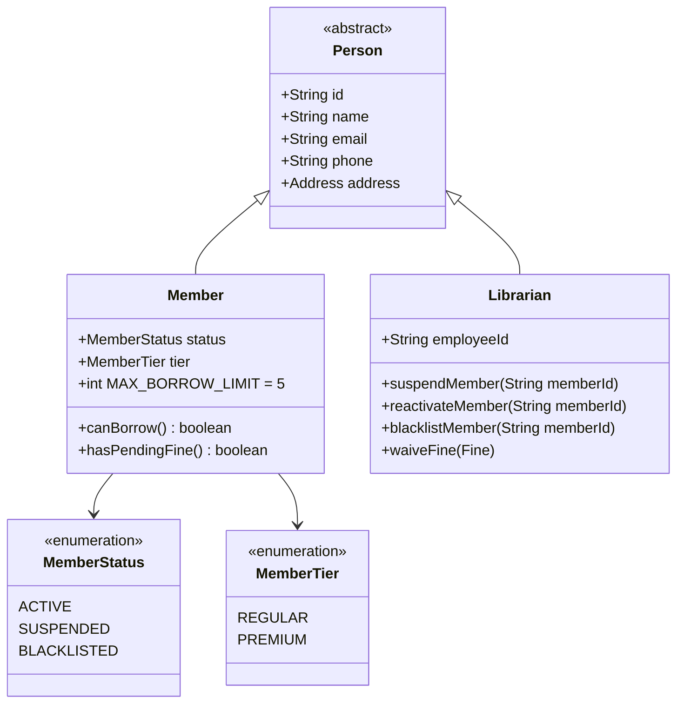
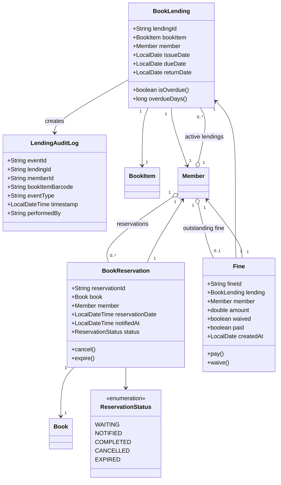
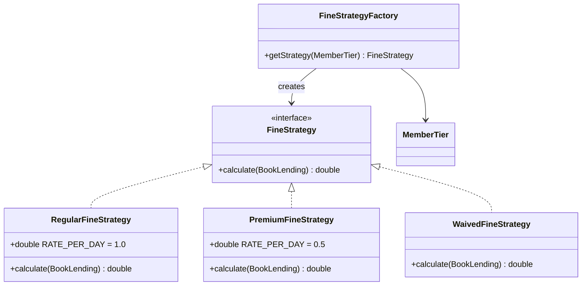
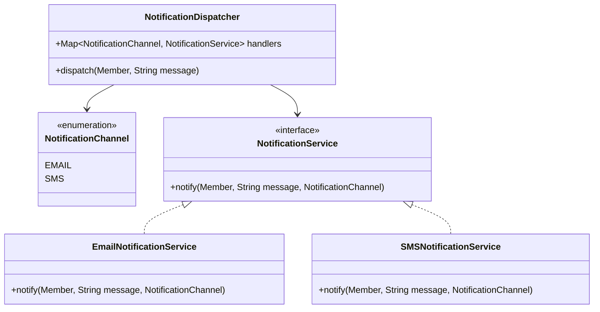
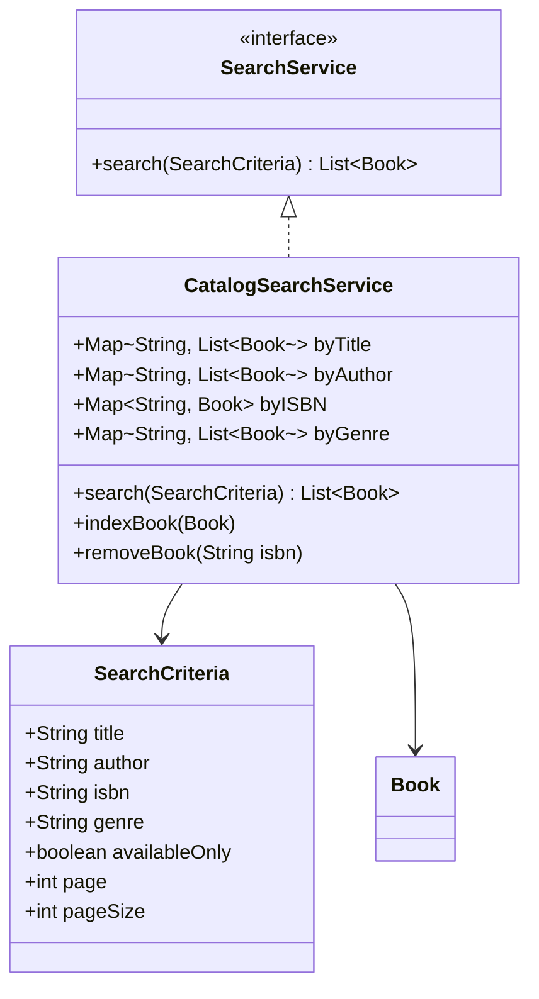
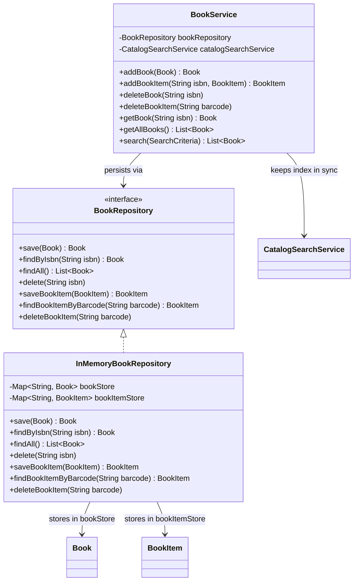
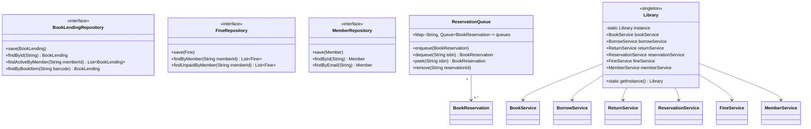

# Library Management System — Class Diagrams

---

## Step 1 — Core Domain (Books Only)

> `Book` is the logical entity (title, ISBN, metadata).  
> `BookItem` is a physical copy of a `Book` — borrow/return operates on `BookItem`.

---

## Step 2 — People

---

## Step 3 — Transactions

---

## Step 4 — Fine Strategy

---

## Step 5 — Notifications

---

## Step 6 — Search & Catalog

---

## Step 7 — Book Service

> `BookService` is the single entry point for managing the book catalog.  
> Added books are persisted via `BookRepository` (in-memory map or DB-backed).  
> `CatalogSearchService` is kept in sync — index updated on add, removed on delete.

---

## Step 8 — Services

```mermaid
classDiagram
    class BorrowService {
        -BookRepository bookRepository
        -NotificationDispatcher notificationDispatcher
        -FineStrategyFactory fineStrategyFactory
        -BookLendingRepository lendingRepo
        +borrowBook(Member, String barcode) BookLending
        +validateMember(Member)
        -selectAvailableCopy(Book) BookItem
    }

    class ReturnService {
        -BookLendingRepository lendingRepo
        -ReservationQueue reservationQueue
        -FineStrategyFactory fineStrategyFactory
        -NotificationDispatcher notificationDispatcher
        +returnBook(Member, String barcode) Fine
        -triggerReservationNotification(Book)
    }

    class ReservationService {
        -ReservationQueue reservationQueue
        -NotificationDispatcher notificationDispatcher
        +reserve(Member, Book) BookReservation
        +cancel(String reservationId)
        +expireStale()
        +notifyNext(Book)
    }

    class FineService {
        -FineRepository fineRepo
        -FineStrategyFactory fineStrategyFactory
        +calculateFine(BookLending) Fine
        +payFine(String fineId)
        +waiveFine(String fineId, Librarian)
    }

    class MemberService {
        -MemberRepository memberRepo
        +register(Member)
        +suspend(String memberId)
        +reactivate(String memberId)
        +blacklist(String memberId)
        +getBorrowHistory(String memberId) List~BookLending~
        +getFineHistory(String memberId) List~Fine~
    }

    BorrowService --> BookRepository
    BorrowService --> NotificationDispatcher
    BorrowService --> FineStrategyFactory
    BorrowService --> BookLendingRepository
    ReturnService --> BookLendingRepository
    ReturnService --> ReservationQueue
    ReturnService --> FineStrategyFactory
    ReturnService --> NotificationDispatcher
    ReservationService --> ReservationQueue
    ReservationService --> NotificationDispatcher
    FineService --> FineRepository
    FineService --> FineStrategyFactory
    MemberService --> MemberRepository
```

---

## Step 9 — Infrastructure

---

## Step 10 — Full Combined Diagram

```mermaid
classDiagram
    class BookItemStatus {
        <<enumeration>>
        AVAILABLE
        BORROWED
        RESERVED
        LOST
        DAMAGED
    }
    class MemberStatus {
        <<enumeration>>
        ACTIVE
        SUSPENDED
        BLACKLISTED
    }
    class MemberTier {
        <<enumeration>>
        REGULAR
        PREMIUM
    }
    class ReservationStatus {
        <<enumeration>>
        WAITING
        NOTIFIED
        COMPLETED
        CANCELLED
        EXPIRED
    }
    class NotificationChannel {
        <<enumeration>>
        EMAIL
        SMS
    }

    class Book {
        +String isbn
        +String title
        +List~String~ authors
        +String genre
        +String publisher
        +String language
        +String edition
        +List~BookItem~ copies
        +getAvailableCopy() BookItem
    }
    class BookItem {
        +String barcode
        +BookItemStatus status
        +synchronized checkout(Member) BookLending
        +synchronized markReturned()
        +markLost()
        +markDamaged()
    }
    class RackLocation {
        +String branchId
        +String aisle
        +String shelf
        +String position
    }

    class Person {
        <<abstract>>
        +String id
        +String name
        +String email
        +String phone
    }
    class Member {
        +MemberStatus status
        +MemberTier tier
        +int MAX_BORROW_LIMIT = 5
        +canBorrow() boolean
        +hasPendingFine() boolean
    }
    class Librarian {
        +String employeeId
        +suspendMember(String memberId)
        +waiveFine(Fine)
    }

    class BookLending {
        +String lendingId
        +LocalDate issueDate
        +LocalDate dueDate
        +LocalDate returnDate
        +boolean isOverdue()
        +long overdueDays()
    }
    class BookReservation {
        +String reservationId
        +LocalDateTime reservationDate
        +LocalDateTime notifiedAt
        +ReservationStatus status
        +cancel()
        +expire()
    }
    class Fine {
        +String fineId
        +double amount
        +boolean waived
        +boolean paid
        +pay()
        +waive()
    }
    class LendingAuditLog {
        +String eventId
        +String eventType
        +LocalDateTime timestamp
        +String performedBy
    }

    class FineStrategy {
        <<interface>>
        +calculate(BookLending) double
    }
    class RegularFineStrategy {
        +double RATE_PER_DAY = 1.0
        +calculate(BookLending) double
    }
    class PremiumFineStrategy {
        +double RATE_PER_DAY = 0.5
        +calculate(BookLending) double
    }
    class WaivedFineStrategy {
        +calculate(BookLending) double
    }
    class FineStrategyFactory {
        +getStrategy(MemberTier) FineStrategy
    }

    class NotificationService {
        <<interface>>
        +notify(Member, String, NotificationChannel)
    }
    class EmailNotificationService {
        +notify(Member, String, NotificationChannel)
    }
    class SMSNotificationService {
        +notify(Member, String, NotificationChannel)
    }
    class NotificationDispatcher {
        +Map~NotificationChannel, NotificationService~ handlers
        +dispatch(Member, String message)
    }

    class SearchCriteria {
        +String title
        +String author
        +String isbn
        +String genre
        +boolean availableOnly
        +int page
        +int pageSize
    }
    class SearchService {
        <<interface>>
        +search(SearchCriteria) List~Book~
    }
    class CatalogSearchService {
        +Map~String, List~Book~~ byTitle
        +Map~String, Book~ byISBN
        +Map~String, List~Book~~ byGenre
        +search(SearchCriteria) List~Book~
        +indexBook(Book)
        +removeBook(String isbn)
    }

    class BookRepository {
        <<interface>>
        +save(Book) Book
        +findByIsbn(String) Book
        +findAll() List~Book~
        +delete(String isbn)
        +saveBookItem(BookItem) BookItem
        +findBookItemByBarcode(String) BookItem
        +deleteBookItem(String barcode)
    }
    class InMemoryBookRepository {
        -Map~String, Book~ bookStore
        -Map~String, BookItem~ bookItemStore
        +save(Book) Book
        +findByIsbn(String) Book
        +findAll() List~Book~
        +delete(String isbn)
        +saveBookItem(BookItem) BookItem
        +findBookItemByBarcode(String) BookItem
        +deleteBookItem(String barcode)
    }
    class BookService {
        -BookRepository bookRepository
        -CatalogSearchService catalogSearchService
        +addBook(Book) Book
        +addBookItem(String isbn, BookItem) BookItem
        +deleteBook(String isbn)
        +deleteBookItem(String barcode)
        +getBook(String isbn) Book
        +getAllBooks() List~Book~
        +search(SearchCriteria) List~Book~
    }

    class BorrowService {
        +borrowBook(Member, String barcode) BookLending
        +validateMember(Member)
    }
    class ReturnService {
        +returnBook(Member, String barcode) Fine
    }
    class ReservationService {
        +reserve(Member, Book) BookReservation
        +cancel(String reservationId)
        +expireStale()
        +notifyNext(Book)
    }
    class FineService {
        +calculateFine(BookLending) Fine
        +payFine(String fineId)
        +waiveFine(String fineId, Librarian)
    }
    class MemberService {
        +register(Member)
        +suspend(String memberId)
        +reactivate(String memberId)
        +blacklist(String memberId)
    }

    class BookLendingRepository {
        <<interface>>
        +save(BookLending)
        +findById(String) BookLending
        +findActiveByMember(String) List~BookLending~
    }
    class FineRepository {
        <<interface>>
        +save(Fine)
        +findUnpaidByMember(String) List~Fine~
    }
    class MemberRepository {
        <<interface>>
        +save(Member)
        +findById(String) Member
    }
    class ReservationQueue {
        +enqueue(BookReservation)
        +dequeue(String isbn) BookReservation
        +remove(String reservationId)
    }
    class Library {
        <<singleton>>
        -static Library instance
        +static getInstance() Library
    }

    Book "1" *-- "1..*" BookItem
    BookItem "1" *-- "1" RackLocation
    BookItem --> BookItemStatus
    Person <|-- Member
    Person <|-- Librarian
    Member --> MemberStatus
    Member --> MemberTier
    Member "1" o-- "0..*" BookLending
    Member "1" o-- "0..*" BookReservation
    Member "1" o-- "0..1" Fine
    BookLending "1" --> "1" BookItem
    BookLending "1" --> "1" Member
    BookLending --> LendingAuditLog : creates
    BookReservation "1" --> "1" Book
    BookReservation "1" --> "1" Member
    BookReservation --> ReservationStatus
    Fine "1" --> "1" BookLending
    Fine "1" --> "1" Member
    FineStrategy <|.. RegularFineStrategy
    FineStrategy <|.. PremiumFineStrategy
    FineStrategy <|.. WaivedFineStrategy
    FineStrategyFactory --> FineStrategy
    FineStrategyFactory --> MemberTier
    NotificationService <|.. EmailNotificationService
    NotificationService <|.. SMSNotificationService
    NotificationDispatcher --> NotificationService
    NotificationDispatcher --> NotificationChannel
    SearchService <|.. CatalogSearchService
    BookRepository <|.. InMemoryBookRepository
    BookService --> BookRepository : persists via
    BookService --> CatalogSearchService : keeps index in sync
    BorrowService --> BookRepository
    BorrowService --> NotificationDispatcher
    BorrowService --> FineStrategyFactory
    BorrowService --> BookLendingRepository
    ReturnService --> BookLendingRepository
    ReturnService --> ReservationQueue
    ReturnService --> FineStrategyFactory
    ReturnService --> NotificationDispatcher
    ReservationService --> ReservationQueue
    ReservationService --> NotificationDispatcher
    FineService --> FineRepository
    FineService --> FineStrategyFactory
    MemberService --> MemberRepository
    Library --> BookService
    Library --> BorrowService
    Library --> ReturnService
    Library --> ReservationService
    Library --> FineService
    Library --> MemberService
    ReservationQueue "1" --> "0..*" BookReservation
```

