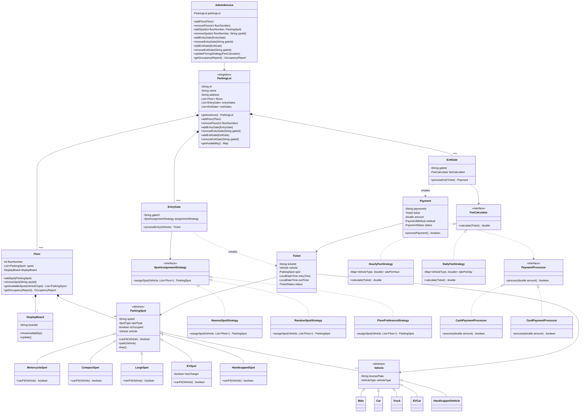

# Parking Lot — Class Diagram

---

## Relationship Legend

| Symbol | Type | Meaning | Lifecycle Dependency |
|--------|------|---------|----------------------|
| `*--` | Composition | Strong ownership — child is created and destroyed with parent | Child dies with parent |
| `o--` | Aggregation | Weak ownership — parent holds child but child exists independently | Child survives parent |
| `<\|--` | Inheritance | "is-a" — subclass extends parent | — |
| `<\|..` | Realization | "implements" — class fulfills interface contract | — |
| `-->` | Association | "has-a" — holds a long-term reference | Independent |
| `..`>` | Dependency | "uses-a" — short-term, method-level usage | Independent |

---

## Relationships Applied

### Composition `*--`
| Relationship | Reason |
|---|---|
| `ParkingLot *-- Floor` | Floor has no meaning outside a lot |
| `ParkingLot *-- EntryGate` | Gate belongs to the lot |
| `ParkingLot *-- ExitGate` | Gate belongs to the lot |
| `Floor *-- ParkingSpot` | Spot belongs to a floor |
| `Floor *-- DisplayBoard` | Board is part of the floor |

### Aggregation `o--`
| Relationship | Reason |
|---|---|
| `ParkingSpot o-- Vehicle` | Vehicle exists before and after parking |

### Inheritance `<\|--`
| Relationship | Reason |
|---|---|
| `ParkingSpot <\|-- MotorcycleSpot / CompactSpot / LargeSpot / EVSpot / HandicappedSpot` | Each spot type is a specialization of ParkingSpot |
| `Vehicle <\|-- Bike / Car / Truck / EVCar / HandicappedVehicle` | Each vehicle type is a specialization of Vehicle |

### Realization `<\|..`
| Relationship | Reason |
|---|---|
| `SpotAssignmentStrategy <\|.. NearestSpotStrategy / RandomSpotStrategy / FloorPreferenceStrategy` | Each strategy implements the assignment interface |
| `FeeCalculator <\|.. HourlyFeeStrategy / DailyFeeStrategy` | Each implements the fee calculation interface |
| `PaymentProcessor <\|.. CashPaymentProcessor / CardPaymentProcessor` | Each implements the payment processing interface |

### Association `-->`
| Relationship | Reason |
|---|---|
| `EntryGate --> SpotAssignmentStrategy` | Gate holds a persistent reference to its strategy |
| `ExitGate --> FeeCalculator` | Gate holds a persistent reference to fee calculator |
| `Ticket --> Vehicle` | Ticket stores vehicle reference for duration of stay |
| `Ticket --> ParkingSpot` | Ticket stores spot reference for duration of stay |
| `Payment --> Ticket` | Payment is always linked to a ticket |
| `AdminService --> ParkingLot` | Admin holds a persistent reference to the lot |

### Dependency `..`>`
| Relationship | Reason |
|---|---|
| `EntryGate ..> Ticket` | Gate creates a ticket but does not own it |
| `ExitGate ..> Payment` | Gate creates a payment but does not own it |
| `Payment ..> PaymentProcessor` | Payment calls processor once during processPayment(), does not hold it long-term |
