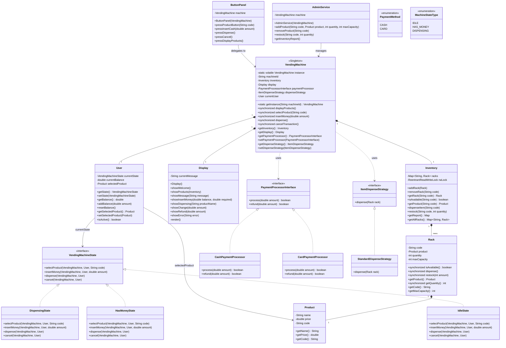

# Vending Machine — Class Diagram

---

## Relationship Legend

| Symbol | Type | Meaning | Lifecycle Dependency |
|--------|------|---------|----------------------|
| `*--` | Composition | Strong ownership — child is created and destroyed with parent | Child dies with parent |
| `o--` | Aggregation | Weak ownership — parent holds child but child exists independently | Child survives parent |
| `<|--` | Inheritance | "is-a" — subclass extends parent | — |
| `<|..` | Realization | "implements" — class fulfills interface contract | — |
| `-->` | Association | "has-a" — holds a long-term reference | Independent |
| `..>` | Dependency | "uses-a" — short-term, method-level usage | Independent |

---

## Relationships Applied

### Composition `*--`
| Relationship | Reason |
|---|---|
| `VendingMachine *-- Inventory` | Inventory has no meaning outside the machine |
| `VendingMachine *-- Display` | Display is owned by and exists only within the machine |
| `VendingMachine *-- User` | User is the current user session, owned by machine |
| `Inventory *-- Rack` | Racks belong to the inventory |
| `Rack *-- Product` | Product definition is owned by the rack |

### Realization `<|..`
| Relationship | Reason |
|---|---|
| `VendingMachineState <|.. IdleState / HasMoneyState / DispensingState` | Each state implements the state interface |
| `PaymentProcessorInterface <|.. CashPaymentProcessor / CardPaymentProcessor` | Each implements payment processing |
| `ItemDispenseStrategy <|.. StandardDispenseStrategy` | Implements dispensing behavior |

### Association `-->`
| Relationship | Reason |
|---|---|
| `User --> VendingMachineState` | User holds current state reference (swapped at runtime) |
| `User --> Product` | User holds reference to currently selected product |
| `ButtonPanel --> VendingMachine` | Panel holds persistent reference, delegates all user actions |
| `AdminService --> VendingMachine` | Admin holds persistent reference to machine for management ops |

### Dependency `..>`
| Relationship | Reason |
|---|---|
| `VendingMachine ..> PaymentProcessorInterface` | Machine uses processor during transaction (swappable strategy) |
| `VendingMachine ..> ItemDispenseStrategy` | Machine uses strategy during dispensing (swappable strategy) |
