# Vending Machine — Class Diagram

```mermaid
classDiagram

    %% ─── CORE ───────────────────────────────────────────────

    class VendingMachine {
        <<Singleton>>
        -static volatile VendingMachine instance
        -String machineId
        -Inventory inventory
        -Display display
        -ButtonPanel buttonPanel
        -PaymentProcessor paymentProcessor
        -DispenseStrategy dispenseStrategy
        -VendingMachineState currentState
        -double balance
        -Product selectedProduct
        +static getInstance(String machineId) VendingMachine
        +synchronized selectProduct(String code)
        +synchronized insertMoney(double amount)
        +synchronized dispense()
        +synchronized cancelTransaction()
        +synchronized displayProducts()
        +setState(VendingMachineState)
        +setSelectedProduct(Product)
        +addBalance(double amount)
        +resetTransaction()
        +getState() VendingMachineState
        +getBalance() double
        +getSelectedProduct() Product
        +getInventory() Inventory
        +getDisplay() Display
        +getButtonPanel() ButtonPanel
        +getPaymentProcessor() PaymentProcessor
        +synchronized setPaymentProcessor(PaymentProcessor)
        +getDispenseStrategy() DispenseStrategy
        +synchronized setDispenseStrategy(DispenseStrategy)
    }

    %% ─── USER INTERFACE ────────────────────────────────────

    class ButtonPanel {
        -VendingMachine machine
        -ConcurrentHashMap~String, Button~ productButtons
        -Button dispenseButton
        -Button cancelButton
        -Button displayButton
        +addProductButton(String code)
        +removeProductButton(String code)
        +pressProductButton(String code)
        +pressInsertCash(double amount)
        +pressDispense()
        +pressCancel()
        +pressDisplayProducts()
    }

    class Button {
        -String label
        -Runnable action
        +Button(String label, Runnable action)
        +press()
        +getLabel() String
    }

    class Display {
        +showWelcome()
        +showProducts(Inventory)
        +showMessage(String)
        +showInsertMoney(double balance, double required)
        +showDispenseSuccess(String productName)
        +showChange(double amount)
        +showRefund(double amount)
        +showError(String error)
    }

    %% ─── INVENTORY ─────────────────────────────────────────

    class Inventory {
        -ConcurrentHashMap~String, Rack~ racks
        +addRack(Rack)
        +removeRack(String code)
        +getRack(String code) Rack
        +isAvailable(String code) boolean
        +getProduct(String code) Product
        +getAllRacks() Map~String, Rack~
    }

    class Rack {
        -String code
        -Product product
        -int maxCapacity
        -AtomicInteger quantity
        +isAvailable() boolean
        +dispense()
        +restock(int amount)
        +getProduct() Product
        +getQuantity() int
        +getCode() String
        +getMaxCapacity() int
    }

    class Product {
        <<immutable>>
        -String code
        -String name
        -double price
        +getCode() String
        +getName() String
        +getPrice() double
    }

    %% ─── STATE PATTERN ─────────────────────────────────────

    class VendingMachineState {
        <<interface>>
        +selectProduct(VendingMachine, String code)
        +insertMoney(VendingMachine, double amount)
        +dispense(VendingMachine)
        +cancel(VendingMachine)
        +getName() String
    }

    class IdleState {
        +selectProduct(VendingMachine, String code)
        +insertMoney(VendingMachine, double amount)
        +dispense(VendingMachine)
        +cancel(VendingMachine)
        +getName() String
    }

    class HasMoneyState {
        +selectProduct(VendingMachine, String code)
        +insertMoney(VendingMachine, double amount)
        +dispense(VendingMachine)
        +cancel(VendingMachine)
        +getName() String
    }

    class DispensingState {
        +selectProduct(VendingMachine, String code)
        +insertMoney(VendingMachine, double amount)
        +dispense(VendingMachine)
        +cancel(VendingMachine)
        +getName() String
    }

    %% ─── PAYMENT (Strategy) ───────────────────────────────

    class PaymentProcessor {
        <<interface>>
        +charge(double amount) boolean
        +refund(double amount) boolean
    }

    class CashPaymentProcessor {
        +charge(double amount) boolean
        +refund(double amount) boolean
    }

    class CardPaymentProcessor {
        +charge(double amount) boolean
        +refund(double amount) boolean
    }

    %% ─── DISPENSING STRATEGY ───────────────────────────────

    class DispenseStrategy {
        <<interface>>
        +dispense(Rack rack)
    }

    class StandardDispenseStrategy {
        +dispense(Rack rack)
    }

    %% ─── ADMIN ─────────────────────────────────────────────

    class AdminService {
        -VendingMachine machine
        +AdminService(VendingMachine)
        +addProduct(String code, Product, int quantity, int maxCapacity)
        +removeProduct(String code)
        +restock(String code, int quantity)
        +printInventoryReport()
    }

    %% ─── EXCEPTIONS ────────────────────────────────────────

    class VendingMachineException {
        <<abstract>>
        +VendingMachineException(String message)
    }

    class InvalidProductException {
        +InvalidProductException(String code)
    }

    class OutOfStockException {
        +OutOfStockException(String code)
    }

    class InsufficientFundsException {
        +InsufficientFundsException(double required, double available)
    }

    class PaymentFailedException {
        +PaymentFailedException()
    }

    class IllegalStateTransitionException {
        +IllegalStateTransitionException(String action, String state)
    }

    %% ─── RELATIONSHIPS ─────────────────────────────────────

    VendingMachine "1" *-- "1" Inventory : owns
    VendingMachine "1" *-- "1" Display : owns
    VendingMachine "1" *-- "1" ButtonPanel : owns
    VendingMachine --> VendingMachineState : currentState
    VendingMachine --> Product : selectedProduct
    VendingMachine ..> PaymentProcessor : uses
    VendingMachine ..> DispenseStrategy : uses

    ButtonPanel "1" *-- "1" Button : dispenseButton
    ButtonPanel "1" *-- "1" Button : cancelButton
    ButtonPanel "1" *-- "1" Button : displayButton
    ButtonPanel "1" *-- "*" Button : productButtons
    ButtonPanel --> VendingMachine : delegates to

    Inventory "1" *-- "*" Rack
    Rack "1" *-- "1" Product

    VendingMachineState <|.. IdleState
    VendingMachineState <|.. HasMoneyState
    VendingMachineState <|.. DispensingState

    PaymentProcessor <|.. CashPaymentProcessor
    PaymentProcessor <|.. CardPaymentProcessor

    DispenseStrategy <|.. StandardDispenseStrategy

    AdminService --> VendingMachine : manages

    VendingMachineException <|-- InvalidProductException
    VendingMachineException <|-- OutOfStockException
    VendingMachineException <|-- InsufficientFundsException
    VendingMachineException <|-- PaymentFailedException
    VendingMachineException <|-- IllegalStateTransitionException
```



---

## Relationship Legend

| Symbol | Type | Meaning | Lifecycle Dependency |
|--------|------|---------|----------------------|
| `*--` | Composition | Strong ownership — child is created and destroyed with parent | Child dies with parent |
| `<|--` | Inheritance | "is-a" — subclass extends parent | — |
| `<|..` | Realization | "implements" — class fulfills interface contract | — |
| `-->` | Association | "has-a" — holds a long-term reference | Independent |
| `..>` | Dependency | "uses-a" — short-term, method-level usage (swappable strategy) | Independent |

---

## Relationships Applied

### Composition `*--`
| Relationship | Reason |
|---|---|
| `VendingMachine *-- Inventory` | Inventory has no meaning outside the machine |
| `VendingMachine *-- Display` | Display is owned by and exists only within the machine |
| `VendingMachine *-- ButtonPanel` | Physical panel is part of the machine |
| `ButtonPanel *-- Button` | Buttons are physical components of the panel |
| `Inventory *-- Rack` | Racks belong to the inventory |
| `Rack *-- Product` | Product definition is owned by the rack slot |

### Realization `<|..`
| Relationship | Reason |
|---|---|
| `VendingMachineState <.. IdleState / HasMoneyState / DispensingState` | Each state implements the state interface |
| `PaymentProcessor <.. CashPaymentProcessor / CardPaymentProcessor` | Each implements payment processing |
| `DispenseStrategy <.. StandardDispenseStrategy` | Implements dispensing behavior |

### Inheritance `<|--`
| Relationship | Reason |
|---|---|
| `VendingMachineException <-- InvalidProductException` | Typed exception for invalid product codes |
| `VendingMachineException <-- OutOfStockException` | Typed exception for empty racks |
| `VendingMachineException <-- InsufficientFundsException` | Typed exception for not enough money |
| `VendingMachineException <-- PaymentFailedException` | Typed exception for processor failures |
| `VendingMachineException <-- IllegalStateTransitionException` | Typed exception for invalid actions in current state |

### Association `-->`
| Relationship | Reason |
|---|---|
| `VendingMachine --> VendingMachineState` | Machine holds current state (swapped at runtime) |
| `VendingMachine --> Product` | Machine holds reference to currently selected product during transaction |
| `ButtonPanel --> VendingMachine` | Panel holds persistent reference, delegates all user actions |
| `AdminService --> VendingMachine` | Admin holds persistent reference for management ops |

### Dependency `..>`
| Relationship | Reason |
|---|---|
| `VendingMachine ..> PaymentProcessor` | Machine uses processor during transaction (swappable strategy) |
| `VendingMachine ..> DispenseStrategy` | Machine uses strategy during dispensing (swappable strategy) |

---

## Thread Safety Model

| Component | Mechanism | What It Protects |
|-----------|-----------|-----------------|
| `VendingMachine` | `synchronized` on user-facing methods | State machine transitions — serializes all transaction mutations |
| `Inventory` | `ConcurrentHashMap` | Admin add/remove concurrent with transaction reads |
| `Rack.quantity` | `AtomicInteger` + CAS loop | Lock-free stock decrement under contention |
| `ButtonPanel.productButtons` | `ConcurrentHashMap` | Dynamic button registration while panel is in use |
| `PaymentProcessor` / `DispenseStrategy` setters | `synchronized` | Safe reconfiguration during idle |

---

## Design Patterns

| Pattern | Applied To | Purpose |
|---------|-----------|---------|
| **State** | `VendingMachineState` → `IdleState`, `HasMoneyState`, `DispensingState` | Eliminates conditionals; invalid actions throw `IllegalStateTransitionException` |
| **Strategy** | `PaymentProcessor`, `DispenseStrategy` | Runtime-swappable payment and dispensing behavior |
| **Command** | `Button` wrapping `Runnable` | Decouples button press from action execution |
| **Singleton** | `VendingMachine` (DCL) | Single machine instance per JVM |
| **Immutable Value** | `Product` (final class, validated in constructor) | Thread-safe sharing without defensive copies |

---

## Dependency Flow (no cycles)

```
Main
 ├── model.VendingMachine
 │    ├── model.Inventory → model.Rack → model.Product
 │    ├── model.Display
 │    ├── model.ButtonPanel → model.Button
 │    ├── state.* (via interface)
 │    ├── payment.* (via interface)
 │    └── dispense.* (via interface)
 ├── model.AdminService → model.VendingMachine
 └── exception.* (thrown, caught at boundaries)
```

States reference `VendingMachine` only as a method parameter — no ownership, no circular dependency.
