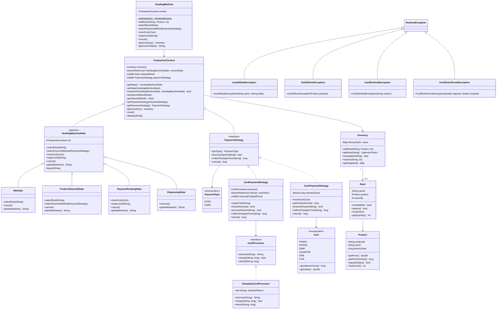

# Vending Machine — Class Diagram

```mermaid
classDiagram
    direction TB

    %% ── Core ─────────────────────────────────────────────────────────────────

    class VendingMachine {
        -TransactionContext context
        +getInstance() VendingMachine$
        +addRack(String, Product, int)
        +selectRack(String)
        +selectPaymentMethod(PaymentStrategy)
        +insertCoin(Coin)
        +swipeCard(String)
        +cancel()
        +getInventory() Inventory
        +getCurrentState() String
    }

    class TransactionContext {
        -Inventory inventory
        -AtomicReference~VendingMachineState~ currentState
        -volatile Rack selectedRack
        -volatile PaymentStrategy paymentStrategy
        +getState() VendingMachineState
        +setState(VendingMachineState)
        +transition(VendingMachineState, VendingMachineState) bool
        +setSelectedRack(Rack)
        +getSelectedRack() Rack
        +setPaymentStrategy(PaymentStrategy)
        +getPaymentStrategy() PaymentStrategy
        +getInventory() Inventory
        +reset()
        +display(String)
    }

    %% ── State ────────────────────────────────────────────────────────────────

    class VendingMachineState {
        <<abstract>>
        #TransactionContext ctx
        +selectRack(String)
        +selectPaymentMethod(PaymentStrategy)
        +insertCoin(Coin)
        +swipeCard(String)
        +cancel()
        +getStateName() String*
        #reject(String)
    }

    class IdleState {
        +selectRack(String)
        +cancel()
        +getStateName() String
    }

    class ProductSelectedState {
        +selectRack(String)
        +selectPaymentMethod(PaymentStrategy)
        +cancel()
        +getStateName() String
    }

    class PaymentPendingState {
        +insertCoin(Coin)
        +swipeCard(String)
        +cancel()
        +getStateName() String
    }

    class DispensingState {
        +execute()
        +getStateName() String
    }

    VendingMachine --> TransactionContext
    TransactionContext o-- VendingMachineState
    VendingMachineState <|-- IdleState
    VendingMachineState <|-- ProductSelectedState
    VendingMachineState <|-- PaymentPendingState
    VendingMachineState <|-- DispensingState

    %% ── Payment ──────────────────────────────────────────────────────────────

    class PaymentStrategy {
        <<interface>>
        +getType() PaymentType
        +processPayment(long) bool
        +collectChangeInCents(long) long
        +refund() long
    }

    class PaymentType {
        <<enumeration>>
        CASH
        CARD
    }

    class CashPaymentStrategy {
        -AtomicLong insertedCents
        +insertCoin(Coin)
        +getInsertedCents() long
        +processPayment(long) bool
        +collectChangeInCents(long) long
        +refund() long
    }

    class CardPaymentStrategy {
        -CardProcessor processor
        -AtomicReference~String~ cardToken
        -volatile long lastChargedCents
        +swipeCard(String)
        +isCardInserted() bool
        +processPayment(long) bool
        +collectChangeInCents(long) long
        +refund() long
    }

    class CardProcessor {
        <<interface>>
        +tokenize(String) String
        +charge(String, long) bool
        +refund(String, long)
    }

    class SimulatedCardProcessor {
        -Set~String~ blockedTokens
        +tokenize(String) String
        +charge(String, long) bool
        +refund(String, long)
    }

    PaymentStrategy <|.. CashPaymentStrategy
    PaymentStrategy <|.. CardPaymentStrategy
    PaymentStrategy --> PaymentType
    CardProcessor <|.. SimulatedCardProcessor
    CardPaymentStrategy --> CardProcessor
    TransactionContext o-- PaymentStrategy
    CashPaymentStrategy --> Coin

    %% ── Inventory ────────────────────────────────────────────────────────────

    class Inventory {
        -Map~String,Rack~ racks
        +addRack(String, Product, int)
        +getRack(String) Optional~Rack~
        +isAvailable(String) bool
        +restock(String, int)
        +getSnapshot() Map
    }

    class Rack {
        -String rackId
        -Product product
        -int quantity
        +isAvailable() bool
        +deduct() bool
        +restock(int)
        +getQuantity() int
    }

    class Product {
        -String productId
        -String name
        -long priceInCents
        +getPrice() double
        +getPriceInCents() long
        +equals(Object) bool
        +hashCode() int
    }

    class Coin {
        <<enumeration>>
        PENNY
        NICKEL
        DIME
        QUARTER
        ONE
        FIVE
        +getValueInCents() long
        +getValue() double
    }

    TransactionContext --> Inventory
    Inventory "1" --> "many" Rack
    Rack --> Product

    %% ── Exceptions ───────────────────────────────────────────────────────────

    class InvalidStateException {
        +InvalidStateException(String action, String state)
    }
    class OutOfStockException {
        +OutOfStockException(Product product)
    }
    class CardDeclinedException {
        +CardDeclinedException(String reason)
    }
    class InsufficientFundsException {
        +InsufficientFundsException(double required, double inserted)
    }

    RuntimeException <|-- InvalidStateException
    RuntimeException <|-- OutOfStockException
    RuntimeException <|-- CardDeclinedException
    RuntimeException <|-- InsufficientFundsException
```
