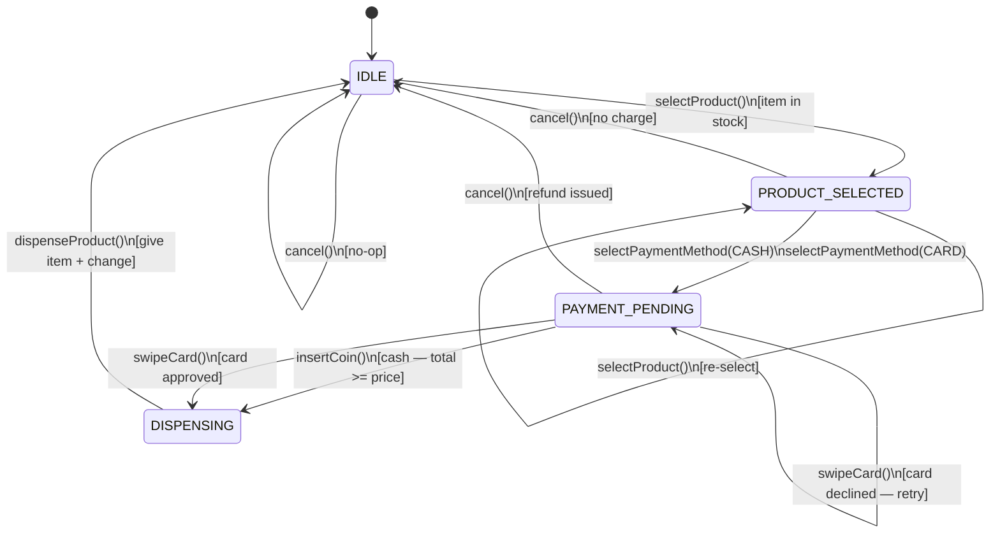
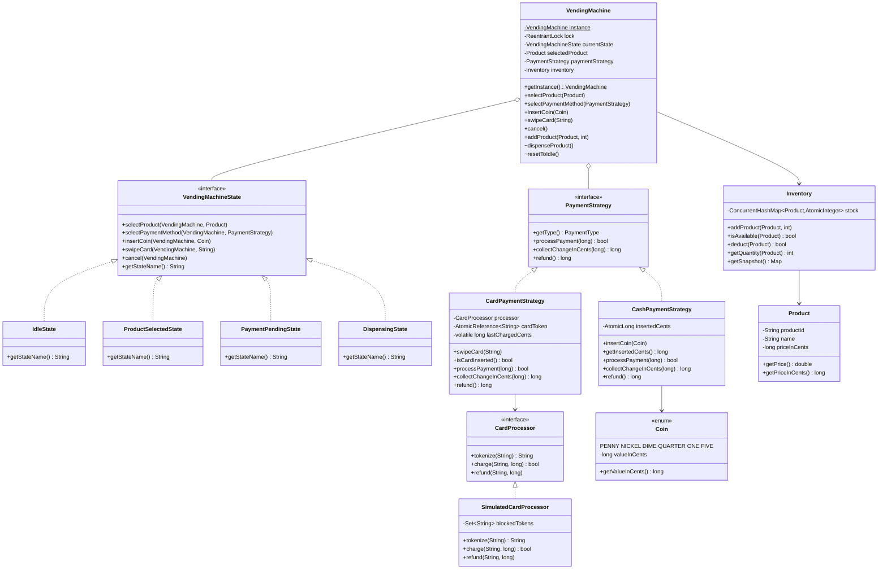
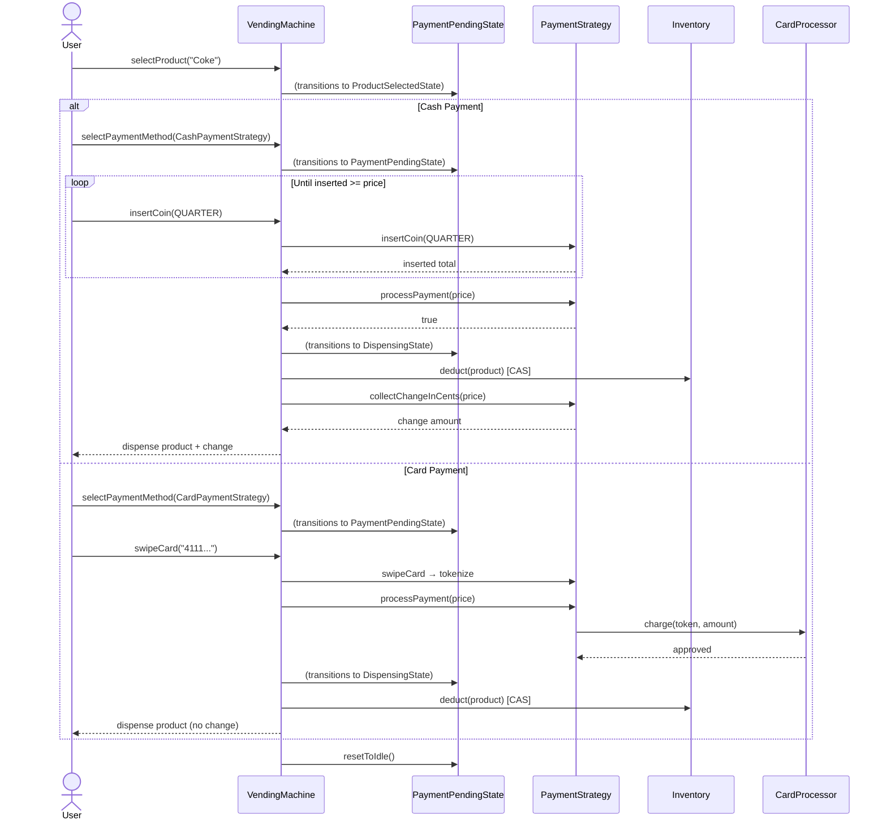

# Vending Machine — Thread-Safe LLD

## Design Decisions

| Concern | Decision |
|---|---|
| FSM | State pattern — each state enforces its own valid transitions |
| Payment | Strategy pattern — `CashPaymentStrategy` and `CardPaymentStrategy` are interchangeable |
| Thread safety | `ReentrantLock(fair=true)` in `VendingMachine` for FSM transitions |
| Inventory | `ConcurrentHashMap<Product, AtomicInteger>` + CAS loop — no global lock for deductions |
| Cash coins | `AtomicLong` (cents) — lock-free coin accumulation |
| Card token | `AtomicReference<String>` — safe card insertion/removal |
| Price precision | All amounts stored as **cents (long)** — avoids floating-point errors |
| Card network | `CardProcessor` interface + `SimulatedCardProcessor` — injectable/mockable |

---

## State Machine Diagram



---

## Class Diagram



---

## Payment Flow Sequence



---

## Thread-Safety Guarantees

| Layer | Mechanism | Protects |
|---|---|---|
| FSM transitions | `ReentrantLock(fair)` in `VendingMachine` | Prevents two threads from concurrently transitioning states |
| Coin accumulation | `AtomicLong` CAS in `CashPaymentStrategy` | No lost coin insertions under concurrent access |
| Card token | `AtomicReference<String>` | Safe concurrent swipe/cancel |
| Inventory deduction | `AtomicInteger` CAS loop in `Inventory.deduct()` | Prevents double-dispense of the last item even if lock is released between check and deduct |

> The CAS loop in `Inventory.deduct()` is the critical double-safety: even if the `ReentrantLock`
> in `VendingMachine` serializes most flows, the inventory guard catches the race where two
> concurrent sessions both reach `dispenseProduct()` for the last unit in stock.

---

## Project Structure

```
src/main/java/vendingmachine/
├── VendingMachine.java              # Singleton, ReentrantLock, FSM orchestration
├── Main.java                        # Demo: 6 scenarios
├── model/
│   ├── Product.java                 # productId, name, priceInCents
│   └── Coin.java                    # Enum: PENNY..FIVE (valueInCents)
├── payment/
│   ├── PaymentStrategy.java         # Strategy interface
│   ├── PaymentType.java             # Enum: CASH, CARD
│   ├── CashPaymentStrategy.java     # AtomicLong coin tracking
│   ├── CardPaymentStrategy.java     # AtomicReference token + CardProcessor
│   ├── CardProcessor.java           # Interface for card network
│   └── SimulatedCardProcessor.java  # Test/demo implementation
├── inventory/
│   └── Inventory.java               # ConcurrentHashMap + AtomicInteger CAS
├── state/
│   ├── VendingMachineState.java     # Interface
│   ├── IdleState.java
│   ├── ProductSelectedState.java
│   ├── PaymentPendingState.java     # Handles both cash & card paths
│   └── DispensingState.java
└── exception/
    ├── InsufficientFundsException.java
    ├── OutOfStockException.java
    ├── InvalidStateException.java
    └── CardDeclinedException.java
```